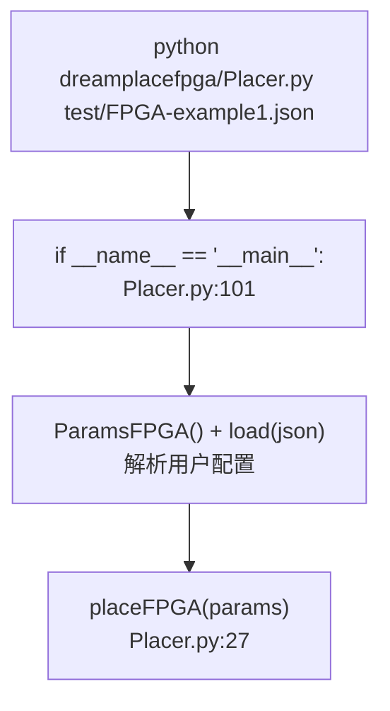
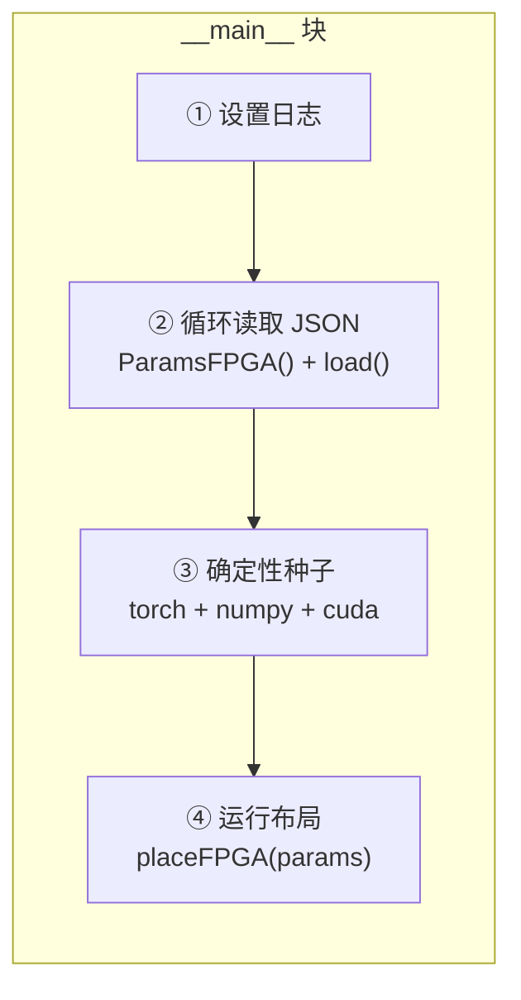
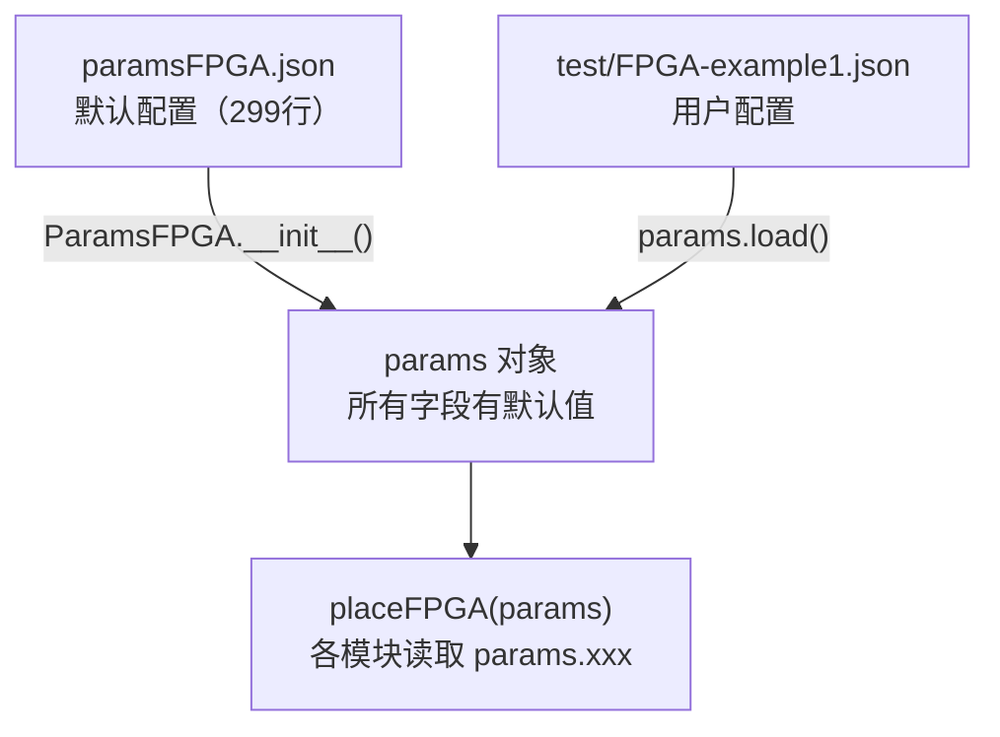
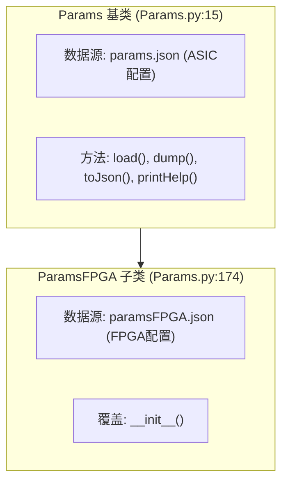
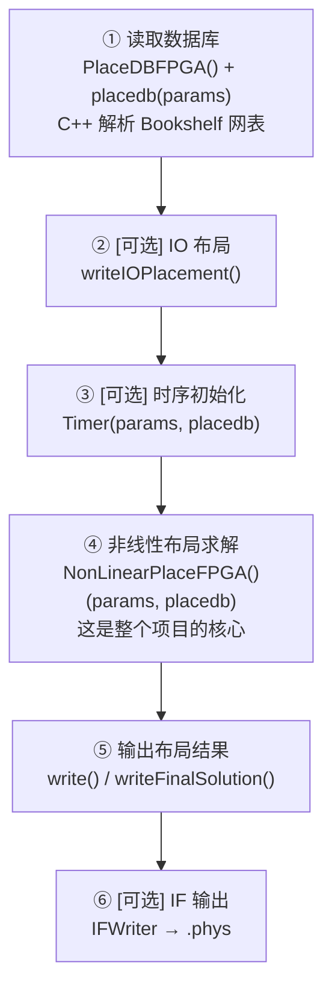
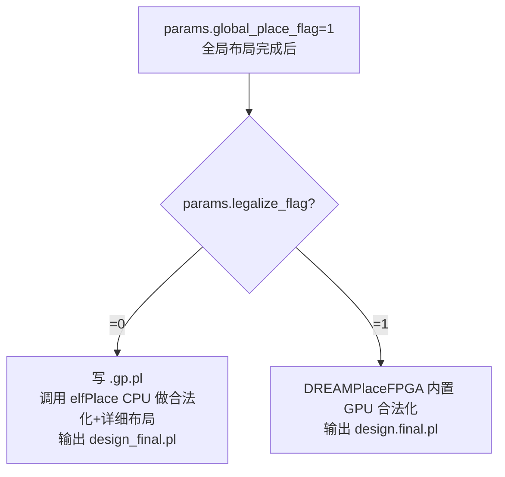
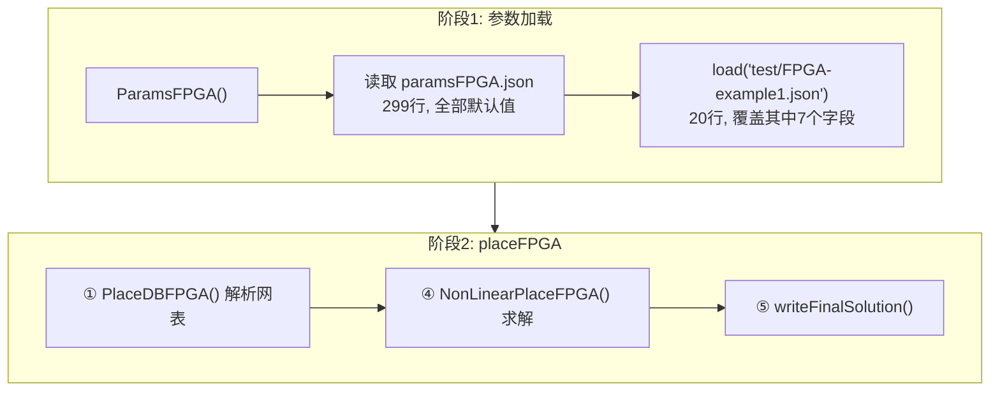
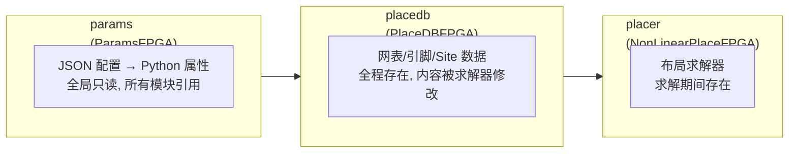

# Day 1: 入口与配置系统 —— DREAMPlaceFPGA 是如何启动的

> **学习日期**: 2026-06-21
> **涉及文件**: `Placer.py`, `Params.py`, `paramsFPGA.json`, `configure.py`, `configure.py.in`
> **前置知识**: 了解 FPGA 布局的基本概念（全局布局 → 合法化 → 详细布局）

---

## 目录

1. [项目入口：命令行到 placeFPGA](#1-项目入口命令行到-placefpga)
2. [参数系统：JSON 驱动的配置管理](#2-参数系统json-驱动的配置管理)
3. [编译配置检测：configure.py](#3-编译配置检测configurepy)
4. [主流程函数：placeFPGA 六步调度](#4-主流程函数placefpga-六步调度)
5. [实战：跟踪一次完整运行](#5-实战跟踪一次完整运行)
6. [核心概念速查](#6-核心概念速查)

---

## 1. 项目入口：命令行到 placeFPGA

### 1.1 启动命令

```bash
python dreamplacefpga/Placer.py test/FPGA-example1.json
```

### 1.2 启动流程图



### 1.3 main 函数做了什么（Placer.py:101-131）



每个步骤的核心代码：

```python
# ① 设置日志
logging.root.name = 'DREAMPlaceFPGA'

# ② 循环读取 JSON —— 支持一次运行多个设计
paramsArray = []
for i in range(1, len(sys.argv)):
    params = ParamsFPGA()        # 先加载 paramsFPGA.json 的默认值
    params.load(sys.argv[i])     # 再用用户 JSON 覆盖
    paramsArray.append(params)

# ③ 确定性设置 —— 保证 run-to-run 可复现
torch.backends.cudnn.deterministic = True
torch.backends.cudnn.benchmark = False
torch.backends.cudnn.enabled = False    # 禁用 cuDNN！
torch.manual_seed(params.random_seed)
np.random.seed(params.random_seed)

# ④ 运行
for params in paramsArray:
    placeFPGA(params)
```

> **⚠️ 关键细节**：`torch.backends.cudnn.enabled = False` **禁用了整了个 cuDNN**。cuDNN 的某些卷积实现在不同 run 之间不保证 bit-level 一致，关掉才能保证可复现。

### 1.4 模块导入要点（第8-24行）

```python
# 将项目根目录加入 sys.path
root_dir = os.path.dirname(os.path.dirname(os.path.abspath(__file__)))
if root_dir not in sys.path:
    sys.path.append(root_dir)
```

`root_dir` = `Placer.py` 的上两级目录 = 项目根目录。这意味着**无论从哪个目录执行，`dreamplacefpga` 包都能被正确导入**。

导入的模块及其角色：

| import | 来源 | 角色 |
|--------|------|------|
| `configure` | `dreamplacefpga/configure.py` | 编译期检测结果（CUDA 是否可用等） |
| `Params` | `dreamplacefpga/Params.py` | 参数对象 |
| `PlaceDB` | `dreamplacefpga/PlaceDB.py` | 设计数据库 |
| `NonLinearPlace` | `dreamplacefpga/NonLinearPlace.py` | 非线性布局引擎 |
| `Timer` | `dreamplacefpga/Timer.py` | 时序分析器 |
| `IFWriter` | `dreamplacefpga/IFWriter.py` | Interchange Format 输出 |

---

## 2. 参数系统：JSON 驱动的配置管理

> **文件**: `Params.py` (190行) + `paramsFPGA.json` (299行)

### 2.1 参数加载流程



### 2.2 类继承关系



**为什么用继承？** DREAMPlaceFPGA 基于 DREAMPlace（ASIC 布局器）。FPGA 版本需要不同的参数（如资源类型、Site 映射），但加载/导出/帮助打印机制完全相同，继承即可复用。

### 2.3 `__init__()` 的工作原理

```python
def __init__(self):
    filename = os.path.join(os.path.dirname(__file__), 'paramsFPGA.json')
    self.__dict__ = {}
    params_dict = json.load(f, object_pairs_hook=OrderedDict)   # 保持 key 顺序
    for key, value in params_dict.items():
        if 'default' in value:
            self.__dict__[key] = value['default']    # 有默认值的取默认值
        else:
            self.__dict__[key] = None                # 否则 None = 必填项
```

> **💡 Python 技巧**：`self.__dict__` 是对象的属性字典，`self.__dict__['gpu'] = 1` 等价于 `self.gpu = 1`。

### 2.4 JSON 参数的规范格式

```json
{
    "参数名": {
        "descripton": "参数描述（注意原代码拼写是 descripton 不是 description）",
        "default": 默认值,
        "required": "必填项写这句话代替 default"
    }
}
```

### 2.5 `load()` 方法 —— 浅层覆盖

```python
def load(self, filename):
    with open(filename, 'r') as f:
        self.fromJson(json.load(f))

def fromJson(self, data):
    for key, value in data.items():
        self.__dict__[key] = value   # 覆盖同名属性
```

只有用户 JSON 里**明确写了**的 key 才会覆盖默认值，没写的保持 `paramsFPGA.json` 中的默认值。

### 2.6 实际例子

**paramsFPGA.json 中的定义**：
```json
"routability_opt_flag": { "default": 0 },
"global_place_stages":   { "required": "required" }
```

**用户的 test/FPGA-example1.json**：
```json
{
    "aux_input": "benchmarks/.../design.aux",
    "global_place_stages": [
        {"num_bins_x": 512, "num_bins_y": 512, "iteration": 2000,
         "learning_rate": 0.01, "wirelength": "weighted_average",
         "optimizer": "nesterov"}
    ],
    "routability_opt_flag": 1
}
```

`global_place_stages` 是一个**列表**，每个元素是一个阶段的配置。这支持多阶段优化：

```json
"global_place_stages": [
    {"num_bins_x": 256, "iteration": 1000, ...},   // 阶段1: 粗粒度
    {"num_bins_x": 512, "iteration": 2000, ...}    // 阶段2: 细粒度
]
```

### 2.7 参数分类速查

**四类必知参数：**

| 类别 | 核心参数 | 作用 |
|------|---------|------|
| 运行模式 | `gpu`, `num_threads`, `dtype` | 决定在哪运行、用多少线程、什么精度 |
| 输入 | `aux_input` | Bookshelf 主索引文件 |
| 优化控制 | `global_place_stages`, `gamma`, `density_weight` | 控制布局求解行为 |
| 功能开关 | `global_place_flag`, `legalize_flag`, `timing_driven_flag`, `routability_opt_flag` | 控制运行哪些步骤 |

**完整参数表：**

| 参数 | 默认值 | 说明 |
|------|--------|------|
| **输入** | | |
| `aux_input` | `""` (必填) | Bookshelf 主索引 `.aux` |
| `scl_file` | `""` | 布局约束 `.scl` |
| `instance_file` | `""` | 实例 `.inst` |
| `net_file` | `""` | 网表 `.net` |
| `pin_file` | `""` | 引脚 `.pin` |
| `routing_file` | `""` | 布线利用率 `.routingUtil` |
| `util_file` | `""` | 利用率 `.util` |
| **运行模式** | | |
| `gpu` | `1` | 0=CPU, 1=GPU |
| `num_threads` | `8` | CPU 线程数 |
| `dtype` | `"float32"` | float32 / float64 |
| `random_seed` | `1000` | 随机初始化种子 |
| `deterministic_flag` | `1` | 是否可复现 |
| **全局布局** | | |
| `global_place_flag` | `1` | 是否运行全局布局 |
| `global_place_stages` | (必填) | 阶段配置列表 |
| `num_bins_x` / `num_bins_y` | `512` | bin 数量 |
| `gamma` | `5.0` | 线长平滑参数 |
| `density_weight` | `8e-5` | 密度代价初始权重 |
| `target_density` | `1.0` | 目标密度 |
| `stop_overflow` | `0.1` | 停止条件 |
| `enable_fillers` | `1` | 启用填充单元 |
| **合法化** | | |
| `legalize_flag` | `1` | 1=GPU内置, 0=外部elfPlace |
| **面积调整** | | |
| `adjust_resource_area_flag` | `1` | LUT/FF 资源面积 |
| `adjust_route_area_flag` | `1` | RUDY 指导面积调整 |
| `adjust_pin_area_flag` | `1` | 引脚利用率指导 |
| `max_num_area_adjust` | `3` | 最大调整次数 |
| **布线拥塞** | | |
| `routability_opt_flag` | `0` | 是否启用 |
| `unit_horizontal_capacity` | `209` | 水平布线轨道/单位距离 |
| `unit_vertical_capacity` | `239` | 垂直布线轨道/单位距离 |
| `unit_pin_capacity` | `50` | 引脚数/单位面积 |
| **时序驱动** | | |
| `timing_driven_flag` | `0` | 是否启用 |
| `max_num_timing_iteration` | `20` | 最大时序迭代 |
| `criticality_exponent` | `9.0` | 关键度指数 |
| `beta_ratio` | `1.1` | 时序与线长梯度比 |
| `lg_alpha` / `lg_beta` | `0.2` / `0.1` | 时序合法化权重 |
| **输出** | | |
| `result_dir` | `"results"` | 输出目录 |
| `plot_flag` | `0` | 画图（增 runtime） |
| `write_tcl_flag` | `0` | Vivado tcl |
| `enable_if` | `0` | Interchange Format |

### 2.8 其他实用方法

| 方法 | 行数 | 示例 |
|------|------|------|
| `design_name()` | 150 | `"benchmarks/FPGA01/design.aux"` → `"design"` |
| `part_name()` | 160 | 从 `interchange_device` 提取器件名 |
| `solution_file_suffix()` | 167 | 返回 `"pl"` |
| `printHelp()` | 45 | 生成 Markdown 表格帮助 |
| `dump(filename)` | 124 | 导出 JSON |

---

## 3. 编译配置检测：configure.py

> **文件**: `configure.py` (27行) + `configure.py.in` (27行)

### 3.1 生成流程


### 3.2 模板 → 实际的转换

`configure.py.in`（模板）→ `configure.py`（编译后）：

```python
# 模板中：
"CUDA_FOUND" : "${CUDA_FOUND}"         # CMake 替换
# 编译后：
"CUDA_FOUND" : "TRUE"                  # 实际值
```

### 3.3 在 Placer.py 中的使用

```python
import dreamplacefpga.configure as configure

# 第32行：前置断言
assert (not params.gpu) or configure.compile_configurations["CUDA_FOUND"] == 'TRUE', \
        "CANNOT enable GPU without CUDA compiled"
```

### 3.4 关键字段

| 字段 | 含义 | 重要性 |
|------|------|--------|
| `CUDA_FOUND` | CUDA 是否被 CMake 找到 | 决定 GPU 加速是否可用 |
| `CMAKE_CXX_ABI` | `_GLIBCXX_USE_CXX11_ABI` 的值 | **必须与 PyTorch 编译 ABI 一致** |
| `CAIRO_FOUND` | Cairo 图形库是否找到 | 找到则画图走 C++（更快） |
| `Boost_INCLUDE_DIRS` | Boost 头文件路径 | C++ 编译时使用 |

> **⚠️ ABI 一致性**：如果 PyTorch 用 `_GLIBCXX_USE_CXX11_ABI=0`（旧 ABI）编译，而 DREAMPlaceFPGA 用 `=1`（新 ABI）编译，链接阶段会失败。通过 `cmake -DCMAKE_CXX_ABI=0` 控制。

---

## 4. 主流程函数：placeFPGA 六步调度

> **文件**: `Placer.py:27-99`

### 4.1 整体流程图



### 4.2 步骤⑤的条件分支



### 4.3 两种运行模式对比

| 方面 | 模式A: `legalize_flag=0` | 模式B: `legalize_flag=1` |
|------|--------------------------|---------------------------|
| 全局布局 | DREAMPlaceFPGA (GPU) | DREAMPlaceFPGA (GPU) |
| 合法化 | elfPlace (CPU) | DREAMPlaceFPGA 内置 (GPU) |
| 详细布局 | elfPlace (CPU) | 不运行 |
| 输出文件 | `.gp.pl` + `_final.pl` | `.final.pl` |

### 4.4 输出文件一览

| 输出文件 | 条件 | 内容 |
|----------|------|------|
| `results/<design>/<design>.gp.pl` | `legalize_flag=0` | 全局布局结果 |
| `results/<design>/<design>_final.pl` | `legalize_flag=0` | 全局+合法化+详细布局 |
| `results/<design>/<design>.final.pl` | `legalize_flag=1` | 全局+内置合法化 |
| `place_cells.tcl` | `write_tcl_flag=1` | Vivado 可导入的 tcl |
| `place_io_cells.tcl` | `write_io_placement_flag=1` | 固定 IO 布局 tcl |
| `results/<design>/<design>.phys` | `enable_if=1` | Interchange Format |

---

## 5. 实战：跟踪一次完整运行

以 `test/FPGA-example1.json` 为例。



### Step 1: `ParamsFPGA()` 后的默认值

```python
params.gpu = 1                    # 启用 GPU
params.num_threads = 8            # 8 线程
params.dtype = "float32"          # 单精度
params.random_seed = 1000
params.global_place_flag = 1      # 运行全局布局
params.legalize_flag = 1          # 内置合法化
params.routability_opt_flag = 0   # 默认不启用布线优化
params.timing_driven_flag = 0     # 默认不启用时序
params.gamma = 5.0
params.density_weight = 8e-5
params.stop_overflow = 0.1
```

### Step 2: `load("test/FPGA-example1.json")` 后的覆盖

| 字段 | 默认值 | 用户覆盖值 |
|------|--------|-----------|
| `aux_input` | `""` | `"benchmarks/.../design.aux"` |
| `num_threads` | `8` | `1` |
| `global_place_stages` | (必填) | `[{512 bins, 2000 iter, nesterov}]` |
| `routability_opt_flag` | `0` | `1` |
| `scale_factor` | `0.0` | `1.0` |
| `deterministic_flag` | `1` | `0` |

### Step 3: 断言检查

```python
# params.gpu=1，configure.CUDA_FOUND='TRUE' → 通过
assert (not params.gpu) or configure.compile_configurations["CUDA_FOUND"] == 'TRUE'
```

---

## 6. 核心概念速查

### 6.1 三大核心对象



### 6.2 调用链速记

```
命令行 JSON → ParamsFPGA().load() → placeFPGA()
                                       ├── PlaceDBFPGA()   ← C++ 解析
                                       ├── Timer()         ← [可选]
                                       ├── NonLinearPlace  ← 核心求解
                                       └── 输出 .pl/.tcl   ← 结果
```

### 6.3 三个最重要的 JSON 参数

```json
{
    "aux_input": "...",               // 哪个设计？
    "global_place_stages": [{...}],    // 怎么优化？
    "gpu": 1                          // 在哪运行？
}
```

---

## 📚 第二天预告

深入 `PlaceDBFPGA`：

- Bookshelf 6 文件格式（`.aux`, `.nodes`, `.nets`, `.pl`, `.scl`, `.wts`）
- `read()` → C++ pybind11 解析全流程
- `initialize()` → filler 单元、fence region 计算
- 数据链：C++ → NumPy → PyTorch Tensor
- FPGA 特有概念：Site Type、Fence Region、LUT/FF/DSP/BRAM/IO
