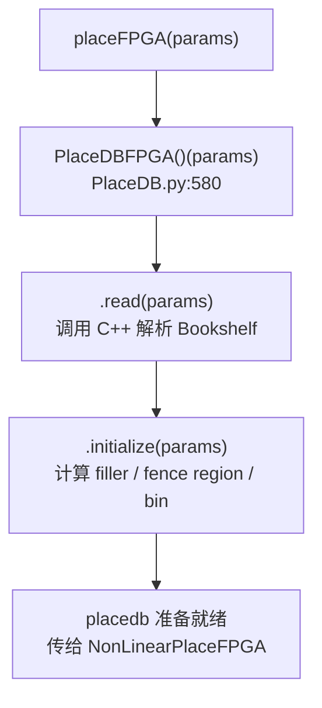
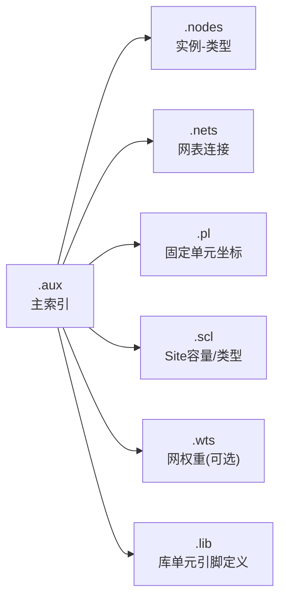
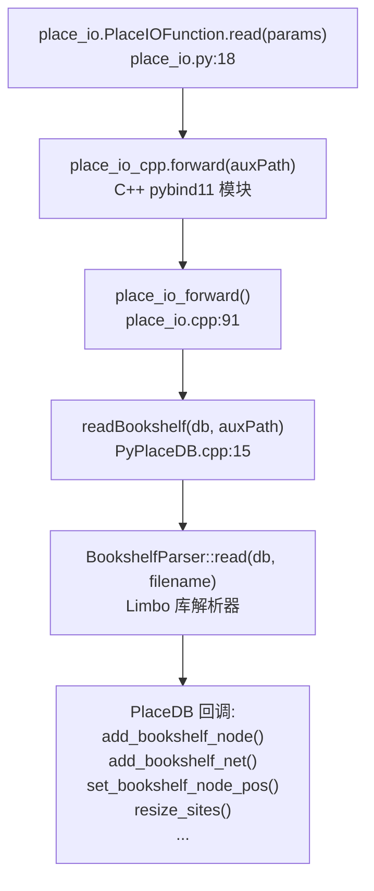
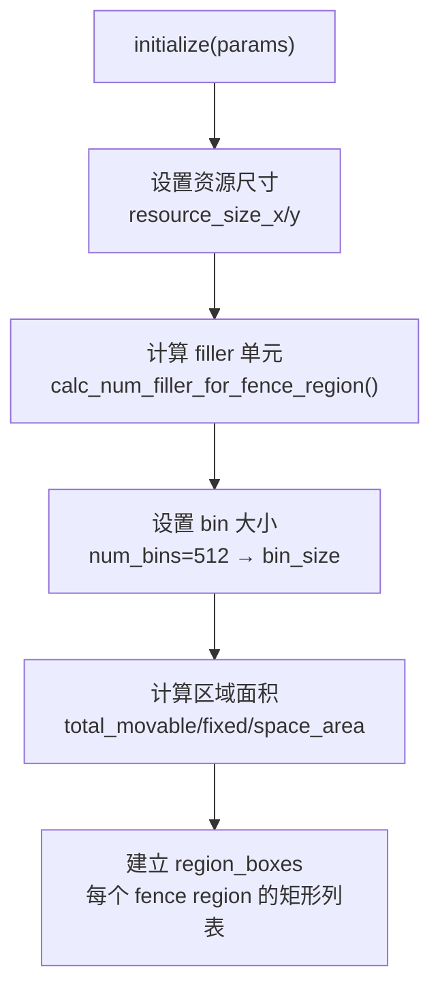
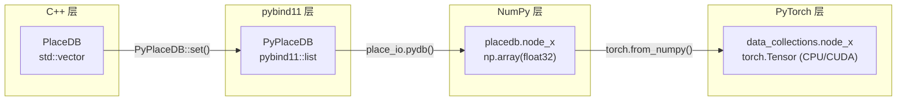
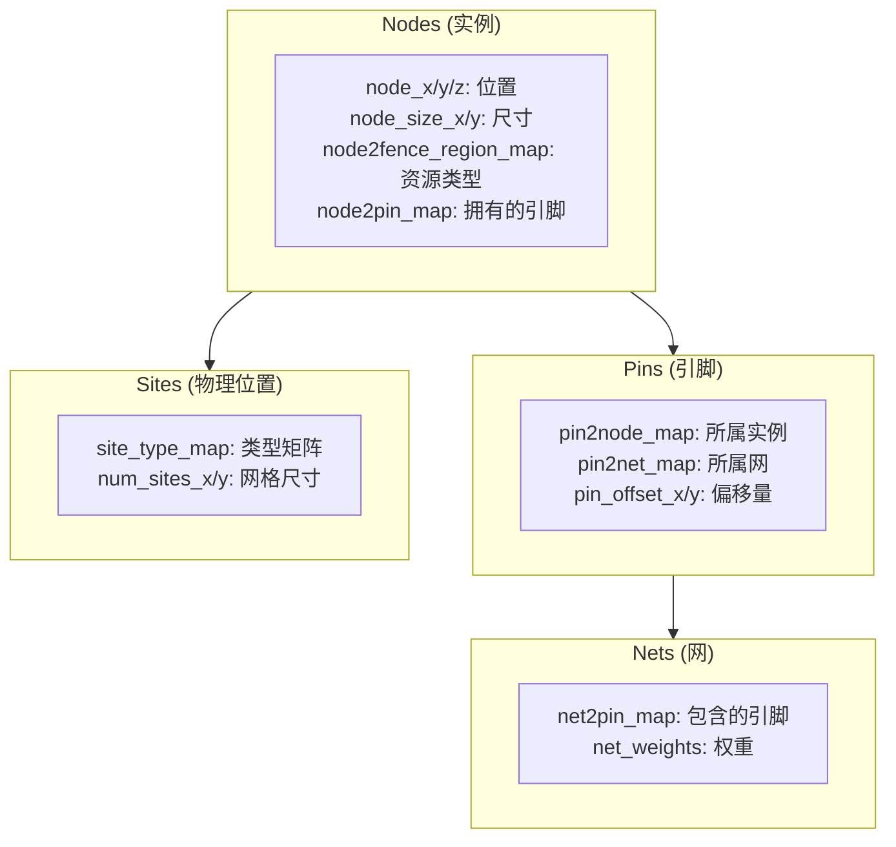

# Day 2: 设计数据库 PlaceDBFPGA —— 从网表到 GPU 张量

> **学习日期**: 2026-06-21
> **涉及文件**: `PlaceDB.py` (944行), `ops/place_io/` (C++ 解析器 + pybind11 绑定)
> **Benchmarks**: `benchmarks/sample_ispd2016_benchmarks/FPGA-example1/`
> **前置知识**: Day1 的调用链 —— placeFPGA() → PlaceDBFPGA()() → read() → initialize()

---

## 目录

1. [PlaceDBFPGA 在流程中的位置](#1-placedbfpga-在流程中的位置)
2. [Bookshelf 格式：6 个文件详解](#2-bookshelf-格式6-个文件详解)
3. [C++ 解析层：pybind11 绑定全链路](#3-c-解析层pybind11-绑定全链路)
4. [FPGA 资源类型与 Site 体系](#4-fpga-资源类型与-site-体系)
5. [PyPlaceDB：Python 可见的数据结构](#5-pyplacedbpython-可见的数据结构)
6. [initialize()：filler + fence region + bin 计算](#6-initializefiller--fence-region--bin-计算)
7. [数据变换链：C++ → pybind11 → NumPy → PyTorch](#7-数据变换链c--pybind11--numpy--pytorch)
8. [核心概念速查](#8-核心概念速查)

---

## 1. PlaceDBFPGA 在流程中的位置



`PlaceDBFPGA` 是整个布局流程的**数据中枢**。它在 Day1 讲的 `placeFPGA()` 的**步骤①**被调用，产生的 `placedb` 对象被后续所有模块（NonLinearPlaceFPGA、Timer、合法化等）使用。

---

## 2. Bookshelf 格式：6 个文件详解

### 2.1 .aux —— 主索引文件

```
# version 3.1    02/08/2016
design : design.nodes design.nets design.wts design.pl design.scl design.lib
```

只一行，列出其他 6 个文件的路径。**只需要在 JSON 里指定 `.aux`，其他文件自动被 C++ 解析器加载。**

### 2.2 .nodes —— 实例（Instance）列表

```
inst_2  RAMB36E2
inst_5  DSP48E2
inst_7  FDRE
inst_1319 LUT2
inst_1269 IBUF
inst_3320 OBUF
```

格式：`实例名 ␣ 单元类型`

这个文件定义了设计中所有的实例及其类型。可移动单元（LUT/FF/DSP/BRAM）和固定单元（IO）都在一起。

### 2.3 .nets —— 网表

```
net clk1_IBUF 2
    inst_4 I
    inst_3340 O
endnet
net clk_BUFGP_net_top_wire 1267
    inst_7 C
    inst_8 C
    ...
endnet
```

格式：
```
net <网名> <引脚数>
    <实例名> <引脚名>
    ...
endnet
```

`inst_4 I` 表示该网连接了实例 `inst_4` 的输入引脚 `I`。一个网可以连接多个引脚（扇出）。

### 2.4 .pl —— 初始布局（Placement）

```
inst_3330 103 0 25 FIXED
inst_1272 103 90 23 FIXED
```

格式：`实例名 ␣ x ␣ y ␣ z ␣ FIXED`

- **x, y**: Site 列索引和行索引
- **z**: 在同一个 Site 内的子位置（LUT/FF 有 16 个 BEL 槽）
- **FIXED**: 固定位置标签。IO 实例是固定的，可移动单元不在此文件中

### 2.5 .scl —— Site 容量约束（Scale）

```
SITE SLICE
  LUT 16
  FF 16
  CARRY8 1
END SITE

SITE DSP
  DSP48E2 1
END SITE

SITE BRAM
  RAMB36E2 1
END SITE

SITE IO
  IO 64
END SITE

RESOURCES
  LUT LUT1 LUT2 LUT3 LUT4 LUT5 LUT6
```

定义了 FPGA 上 4 种 Site 类型的容量：
- **SLICE**: 每个 Site 可容纳 16 个 LUT + 16 个 FF + 1 个 CARRY8
- **DSP**: 1 个 DSP48E2
- **BRAM**: 1 个 RAMB36E2
- **IO**: 64 个 IO
- **RESOURCES**: 列出合法的 LUT 子类型

### 2.6 .wts —— 网权重

```
# Intentionally left empty
```

可选文件。用于给特定网赋权重（如时序关键路径），在示例中为空。

### 2.7 文件关系图



---

## 3. C++ 解析层：pybind11 绑定全链路

### 3.1 调用链



### 3.2 三层架构

| 层 | 文件 | 语言 | 职责 |
|---|------|------|------|
| Python 接口 | `place_io.py` | Python | `torch.autograd.Function` 封装 |
| pybind11 模块入口 | `place_io.cpp` | C++ | `PYBIND11_MODULE` 定义导出函数 |
| PlaceDB 绑定 | `PybindPlaceDB.cpp` | C++ | 将 `PlaceDB` 类的所有方法暴露给 Python |
| PyPlaceDB 绑定 | `PybindPyPlaceDB.cpp` | C++ | 将 `PyPlaceDB` 结构体的字段暴露为 Python 属性 |
| 数据转换 | `PyPlaceDB.cpp` | C++ | `PyPlaceDB::set(PlaceDB&)` 转换 C++ 数据到 pybind11 |
| 解析 + 数据库 | `PlaceDB.h` | C++ | 继承自 Limbo `BookshelfDataBase`，实现回调 |

### 3.3 place_io.cpp 的模块导出（第122-150行）

```cpp
PYBIND11_MODULE(TORCH_EXTENSION_NAME, m) {
    bind_PlaceDB(m);       // 导出 PlaceDB 类的方法
    bind_PyPlaceDB(m);     // 导出 PyPlaceDB 结构体字段

    m.def("forward",  &place_io_forward, "读取 Bookshelf");
    m.def("forward_interchange", &place_io_forward_interchange, "读取 IF");
    m.def("pydb", [](PlaceDB const& db) { return PyPlaceDB(db); }, "转换");
    m.def("write", ...);   // 写布局结果
    m.def("apply", ...);   // 应用布局解
}
```

`TORCH_EXTENSION_NAME` 是 PyTorch 的 CMake 扩展机制定义的宏，编译后生成 `place_io_cpp.so`。

### 3.4 PlaceDB 的双重继承

```cpp
class PlaceDB : public BookshelfParser::BookshelfDataBase   // ← Limbo 解析器基类
              , public DREAMPLACE_NAMESPACE::InterchangeDataBase  // ← IF 解析器基类
{
    // 实现虚函数回调，解析器调用这些函数填充数据
    virtual void add_bookshelf_node(std::string& name, std::string& type);
    virtual void add_bookshelf_net(BookshelfParser::Net const& n);
    virtual void set_bookshelf_node_pos(std::string const& name, double x, double y, int z);
    virtual void resize_sites(int xSize, int ySize);
    virtual void site_info_update(int x, int y, int val);
    // ...
};
```

**解析流程**：Limbo 解析器逐行读取 `.aux` 引用的各文件，读到 `inst_X TYPE` 时回调 `add_bookshelf_node()`，读到 `net ... endnet` 时回调 `add_bookshelf_net()`。数据逐条填充到 `PlaceDB` 内部的 `std::vector` 中。

---

## 4. FPGA 资源类型与 Site 体系

### 4.1 五种资源类型（Fence Region）


`self.regions = 5` 对应五种资源类型。每种类型有独立的 fence region（布局区域约束）。

### 4.2 Site Type Map

在 `PlaceDB.h:276` 中，`m_siteDB` 是一个 2D 数组 `[num_sites_x][num_sites_y]`，每个元素的值：

| 值 | 含义 | Fence Region |
|----|------|-------------|
| 0 | 空 | - |
| 1 | SLICE（LUT+FF） | 0(LUT), 1(FF) |
| 2 | DSP | 2 |
| 3 | BRAM | 3 |
| 4 | IO | 4 |

### 4.3 Z 轴：BEL 位置

在 Xilinx UltraScale 架构中，每个 SLICE Site 包含 16 个 BEL（Basic Element）槽位。`node_z` 字段记录实例在 Site 内的具体 BEL 编号：

| z | BEL (LUT) | BEL (FF) |
|---|-----------|----------|
| 0 | A5LUT | AFF |
| 1 | A6LUT | AFF2 |
| 2 | B5LUT | BFF |
| ... | ... | ... |
| 15 | H6LUT | HFF2 |

函数 `map_bel()` (PlaceDB.py:493) 负责将 `(node_z, node_type)` 映射为 Vivado BEL 名称。

### 4.4 node2fence_region_map

这是一个长度为 `num_physical_nodes` 的数组，值 ∈ {0,1,2,3,4}，记录每个实例属于哪个 fence region：

```python
# PlaceDB.py:239-243
self.lut_mask = self.node2fence_region_map == 0
self.flop_mask = self.node2fence_region_map == 1
self.dsp_mask = self.node2fence_region_map == 2
self.ram_mask = self.node2fence_region_map == 3
# IO: region 4
```

---

## 5. PyPlaceDB：Python 可见的数据结构

### 5.1 数据转换：C++ → PyPlaceDB

`PyPlaceDB::set(PlaceDB const& db)` 在 `PyPlaceDB.cpp:51` 实现。核心逻辑：

```cpp
void PyPlaceDB::set(PlaceDB const& db) {
    // 数量统计
    num_terminals = db.numFixed();
    num_movable_nodes = db.numMovable();
    num_physical_nodes = num_terminals + num_movable_nodes;

    // node_count: [numLUT, numFF, numDSP, numRAM, numIO]
    node_count.append(db.numLUT());
    node_count.append(db.numFF());
    node_count.append(db.numDSP());
    node_count.append(db.numRAM());
    node_count.append(num_terminals);

    // Movable + Fixed 拼接：前 num_movable 是 movable，后 num_terminals 是 fixed
    node_names   = db.movNodeNames() + db.fixedNodeNames();
    node_types   = db.movNodeTypes() + db.fixedNodeTypes();
    node_x       = db.movNodeXLocs() + db.fixedNodeXLocs();
    node_y       = db.movNodeYLocs() + db.fixedNodeYLocs();
    node_z       = db.movNodeZLocs() + db.fixedNodeZLocs();
    node2fence_region_map = db.node2FenceRegionMap() + [4,4,...]; // IO → 4
    // ...
}
```

> **💡 关键约定**：数组中**前 `num_movable_nodes` 个是可移动单元，后 `num_terminals` 个是固定 IO**。这个顺序在后续所有 GPU 算子中都是隐含假设。

### 5.2 PyPlaceDB 全部字段

| 字段 | 类型 | 内容 |
|------|------|------|
| `node_names` | `list[str]` | 实例名 |
| `node_types` | `list[str]` | 实例类型（FDRE, LUT2, DSP48E2...） |
| `node_size_x/y` | `list[float]` | 实例宽高 |
| `node_x/y/z` | `list[float/int]` | 实例位置坐标 |
| `node2fence_region_map` | `list[int]` | 所属 fence region |
| `node2pin_map` | `list[list[int]]` | 每个 node 的引脚 ID 列表 |
| `flat_node2pin_map/start_map` | `list[int]` | node2pin_map 的扁平版本 |
| `node2pincount_map` | `list[int]` | 每个 node 的引脚数量 |
| `node2outpinIdx_map` | `list[int]` | 每个 node 的输出引脚索引 |
| `lut_type` | `list[int]` | LUT 类型（2/3/4/5/6 输入） |
| `cluster_lut_type` | `list[int]` | 聚类用 LUT 类型 |
| `flop_indices` | `list[int]` | FF 的索引列表 |
| `num_terminals` / `num_movable_nodes` | `int` | IO 数 / 可移动单元数 |
| `num_physical_nodes` | `int` | 总实例数 |
| `node_count` | `list[int]` | 各类型计数 [LUT,FF,DSP,BRAM,IO] |
| `pin_names/types/typeIds` | `list` | 引脚名/类型/类型ID |
| `pin_offset_x/y` | `list[float]` | 引脚相对 node 的偏移 |
| `pin2node_map` | `list[int]` | 引脚→所属 node |
| `pin2net_map` | `list[int]` | 引脚→所属 net |
| `pin2nodeType_map` | `list[int]` | 引脚→node 类型 |
| `net_names` | `list[str]` | 网名 |
| `net2pin_map` | `list[list[int]]` | 每个 net 的引脚 ID 列表 |
| `flat_net2pin_map/start_map` | `list[int]` | net2pin_map 扁平版 |
| `num_sites_x/y` | `int` | Site 网格列/行数 |
| `site_type_map` | `list[list[int]]` | 2D Site 类型矩阵 |
| `site_name_map` | `list[list[str]]` | 2D Site 名称矩阵 |
| `lg_siteXYs` | `list[list[float]]` | CLB Site 中心坐标 |
| `dspSiteXYs` / `ramSiteXYs` | `list[list[float]]` | DSP/RAM Site 坐标 |
| `flat_region_boxes/start` | `list` | fence region 的扁平矩形列表 |
| `ctrlSets` / `flat_ctrlSets` | `list` | FF 控制集信息 |
| `tnet2net_map` 等 | `list` | 时序网映射 |
| `spiral_accessor` | `list[(int,int)]` | 螺旋搜索访问器 |

---

## 6. initialize()：filler + fence region + bin 计算

`PlaceDBFPGA.initialize()` (PlaceDB.py:631) 在 C++ 读取完成后被调用，负责初始化布局求解所需的参数。

### 6.1 流程图



### 6.2 Filler 单元

Filler（填充单元）的作用是**将空白区域转换为虚拟可移动单元**，让密度约束均匀覆盖整个芯片。

```python
# 每种资源类型的 filler 尺寸
self.filler_size_x = [sqrt(0.125), sqrt(0.125), 1.0, 1.0]   # LUT, FF, DSP, RAM
self.filler_size_y = [sqrt(0.125), sqrt(0.125), 2.5, 5.0]
```

`calc_num_filler_for_fence_region()` 对每个 fence region：

```python
placeable_area = sum(region 矩形面积)
total_movable_area = sum(node_area in this region)
total_filler_area = max(placeable_area - total_movable_area, 0)
num_filler = floor(total_filler_area / (filler_size_x * filler_size_y))
```

Filler 节点被追加到 `node_size_x` 和 `node_size_y` 数组的末尾。

### 6.3 Fence Region Boxes

在 `PyPlaceDB::set()` 中（PyPlaceDB.cpp:269），通过扫描 `site_type_map` 的每一列，统计每种 Site 类型出现在哪些列索引上，然后构建每列的矩形区域：

```cpp
// 伪代码
for col in siteColumns:
    if site_type == 1:  colSet0.insert(col), colSet1.insert(col)
    if site_type == 2:  colSet2.insert(col)
    if site_type == 3:  colSet3.insert(col)
    if site_type == 4:  colSet4.insert(col)

// 为每种类型生成矩形: [col, 0, col+1, height]
flat_region_boxes = [[col, 0, col+1, height] for each unique col]
```

**结果**：`flat_region_boxes` 是一维数组，每 4 个值构成一个矩形 `[xl, yl, xh, yh]`。`flat_region_boxes_start` 记录每种类型的起始索引。

### 6.4 Bin 大小

```python
self.num_bins_x = 512
self.num_bins_y = 512
self.bin_size_x = self.width / self.num_bins_x
self.bin_size_y = self.height / self.num_bins_y
```

默认 512×512 的密度 bin 网格。每个 bin 的大小 = 芯片宽高 / 512。

---

## 7. 数据变换链：C++ → pybind11 → NumPy → PyTorch



**代码路径**：

```python
# Step 1: C++ → PyPlaceDB
self.rawdb = place_io.PlaceIOFunction.read(params)  # 返回 PlaceDB (C++ 对象)

# Step 2: PyPlaceDB → NumPy (PlaceDB.py:249)
pydb = place_io.PlaceIOFunction.pydb(self.rawdb)    # 返回 PyPlaceDB
self.node_x = np.array(pydb.node_x, dtype=self.dtype)  # pybind11::list → np.array

# Step 3: NumPy → PyTorch (BasicPlace.py:57)
self.node_x = torch.from_numpy(placedb.node_x).to(device)  # np.array → torch.Tensor
```

> **💡 为什么分三步？** C++ 解析速度快；pybind11::list 是 Python 与 C++ 之间的通用容器；NumPy 数组在 CPU 内存中；PyTorch Tensor 可以搬到 GPU。每层有各自的优势。

---

## 8. 核心概念速查

### 8.1 关键数据结构关系



### 8.2 PlaceDBFPGA 的关键属性

| 属性 | 类型 | 含义 |
|------|------|------|
| `num_movable_nodes` | int | 可移动单元数 |
| `num_terminals` | int | 固定 IO 数 |
| `num_physical_nodes` | int | = movable + terminals |
| `num_filler_nodes` | int | 虚拟填充单元数 |
| `num_nodes` | int | = physical + filler（求解器处理的总节点数） |
| `regions` | int | = 5（LUT/FF/DSP/BRAM/IO） |
| `num_bins_x/y` | int | 密度 bin 网格尺寸 |
| `flat_region_boxes` | np.array | fence region 矩形列表 |

### 8.3 本节最重要的理解

1. **数据流向**：Bookshelf 文本 → Limbo 解析器回调 → `PlaceDB` C++ vector → `PyPlaceDB` pybind11 list → NumPy array → PyTorch Tensor
2. **数组顺序约定**：前 `num_movable_nodes` 个是可移动单元，后 `num_terminals` 个是固定 IO
3. **五种资源类型**各有独立的 fence region 和 filler 单元
4. **Z 轴表示**同一 SLICE Site 内的 BEL 槽位编号，决定 LUT/FF 在 Site 内的精确位置

---

## 📚 第三天预告

深入 `PlaceDataCollectionFPGA` 和算子体系：

- `BasicPlace.py` 如何封装所有数据张量
- 22 个 GPU 算子的统一结构（.py → .cpp → .cu）
- `move_boundary` 简单算子完整走读
- 数据在 GPU 和 CPU 之间的同步机制
