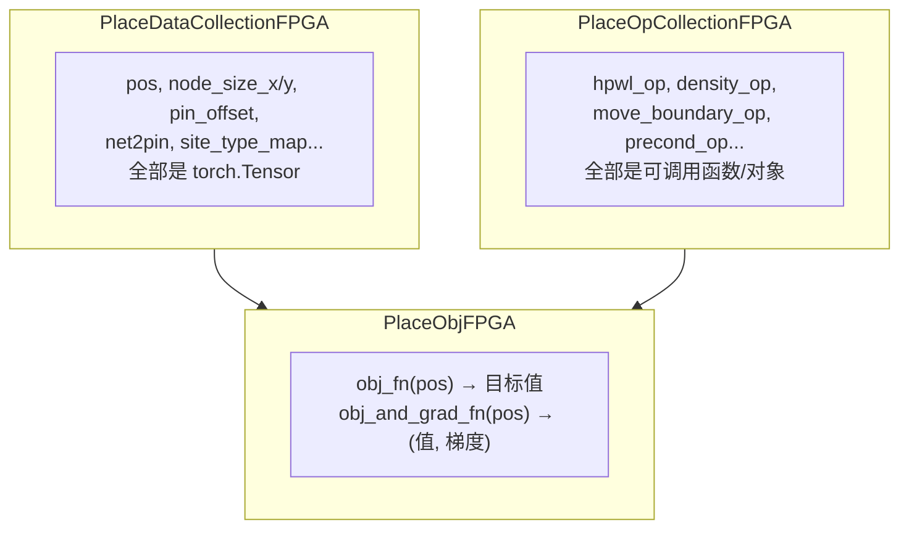
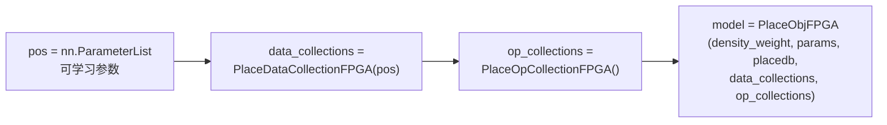
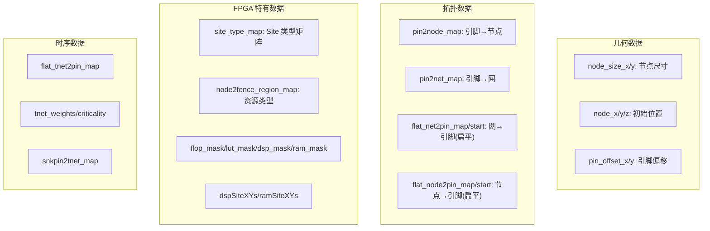
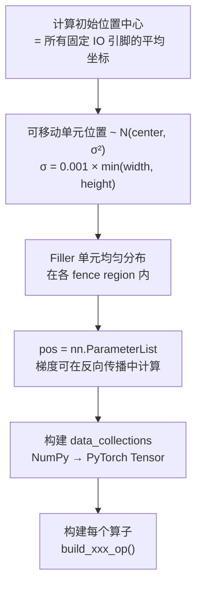
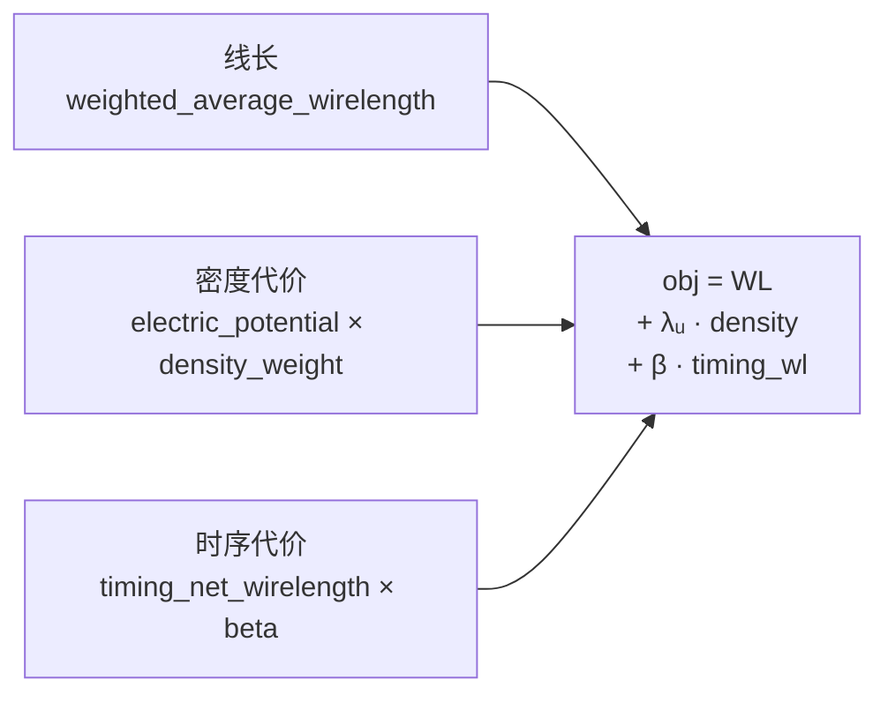
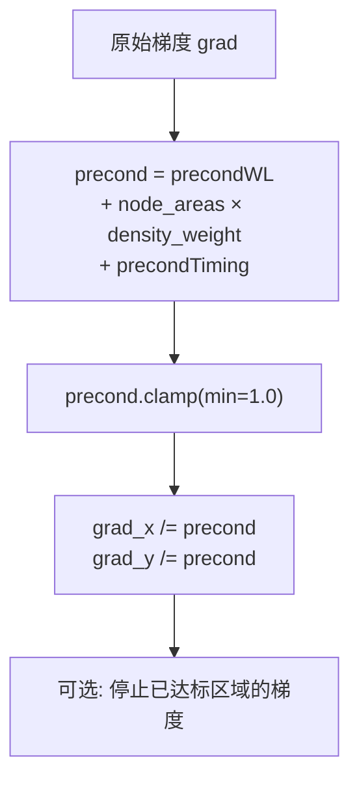
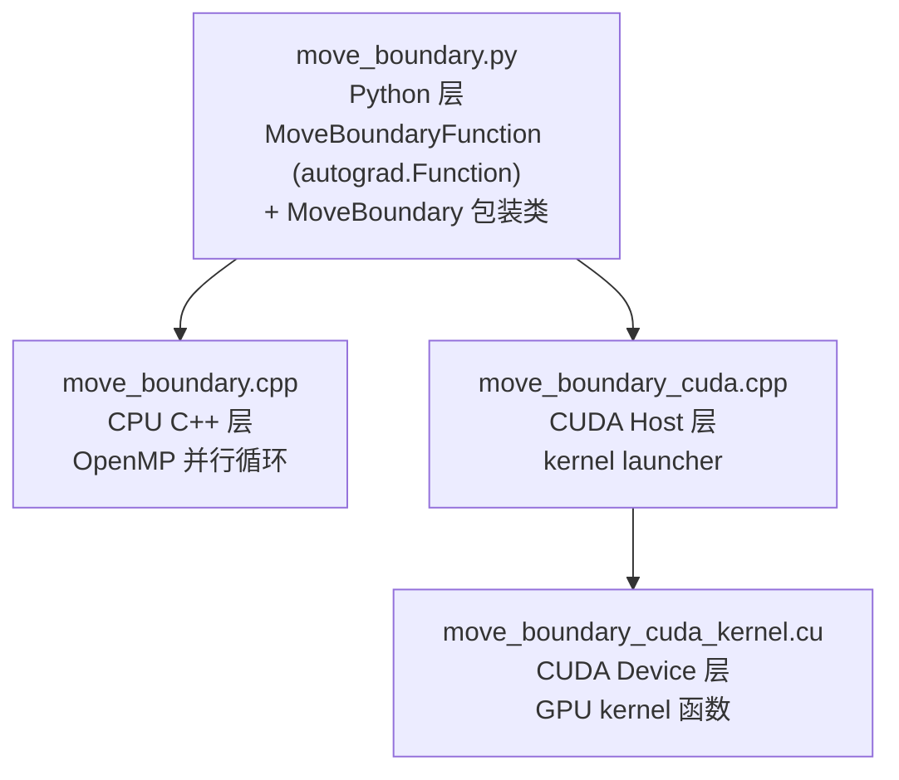
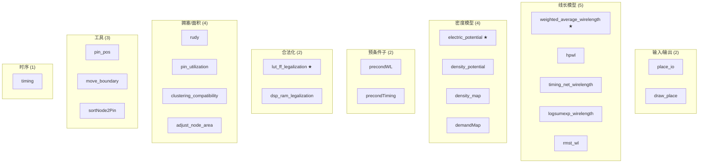
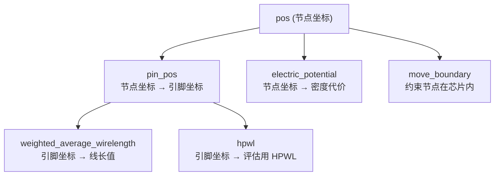

# Day 3: 数据封装与算子体系 —— BasicPlace + PlaceObj + GPU 算子

> **学习日期**: 2026-06-21
> **涉及文件**: `BasicPlace.py` (702行), `PlaceObj.py` (963行), `ops/move_boundary/` (算子示例)
> **前置知识**: Day1 `placeFPGA()` 流程, Day2 `PlaceDBFPGA` 数据结构

---

## 目录

1. [整个求解器的三角架构](#1-整个求解器的三角架构)
2. [PlaceDataCollectionFPGA：数据搬到 GPU](#2-placedatacollectionfpga数据搬到-gpu)
3. [BasicPlaceFPGA：随机初始化 + 算子构建](#3-basicplacefpga随机初始化--算子构建)
4. [PlaceObjFPGA：目标函数 = 线长 + 密度 + 时序](#4-placeobjfpga目标函数--线长--密度--时序)
5. [GPU 算子统一架构：以 move_boundary 为例](#5-gpu-算子统一架构以-move_boundary-为例)
6. [算子全景图](#6-算子全景图)
7. [核心概念速查](#7-核心概念速查)

---

## 1. 整个求解器的三角架构



**三个对象的分工**：

| 对象 | 类（文件） | 职责 |
|------|-----------|------|
| `data_collections` | `PlaceDataCollectionFPGA` (BasicPlace.py:39) | 将 NumPy 转为 PyTorch Tensor，搬到 GPU |
| `op_collections` | `PlaceOpCollectionFPGA` (BasicPlace.py:198) | 持有所有算子的引用 |
| `model` | `PlaceObjFPGA` (PlaceObj.py:103) | 组合算子构成目标函数，提供 `obj_and_grad_fn` 给优化器 |

**三者创建顺序**（在 NonLinearPlaceFPGA.__call__ 中）：



---

## 2. PlaceDataCollectionFPGA：数据搬到 GPU

> **文件**: `BasicPlace.py:39-196`

### 2.1 核心职责

`PlaceDataCollectionFPGA` 是一个**纯数据容器**。在 `with torch.no_grad()` 下，将 `placedb` 中的 NumPy 数组逐个转为 PyTorch Tensor 并搬到 GPU（或 CPU）。

### 2.2 数据分类



### 2.3 关键代码模式

```python
# 每种数据都是同样的模式：numpy → torch → device
self.node_size_x = torch.from_numpy(placedb.node_size_x).to(device)
self.pin2node_map = torch.from_numpy(placedb.pin2node_map).to(device)
# ...

# 计算派生量
self.node_areas = self.node_size_x * self.node_size_y  # 节点面积

# 资源类型掩码
self.flop_mask = torch.from_numpy(placedb.flop_mask).to(device)
self.flop_lut_mask = self.flop_mask | self.lut_mask   # FF 或 LUT
```

### 2.4 pos 张量的特殊结构

`pos` 是所有节点的 **(x, y) 坐标拼接的一维张量**：

```
pos = [x₀, x₁, ..., xₙ₋₁, y₀, y₁, ..., yₙ₋₁]
       ├── num_nodes 个 x ──┤├── num_nodes 个 y ──┤
```

其中 `num_nodes = num_physical_nodes + num_filler_nodes`。

通过 `.view(2, -1)` 可以拆成 2×N，分开操作 x 和 y。

### 2.5 其他重要数据

| 变量 | 计算方式 | 用途 |
|------|---------|------|
| `pin_weights` | `flat_node2pin_start[1:] - flat_node2pin_start[:-1]` | 每个节点的引脚数 |
| `sorted_node_map` | `sort(movable_size_x)` | 按尺寸排序，用于电场计算的内存合并 (coalesce) |
| `net_mask_ignore_large_degrees` | `2 <= degree < params.ignore_net_degree` | 过滤大扇出网（时钟网等） |
| `pin_mask_ignore_fixed_macros` | `pin2node_map >= num_movable_nodes` | 标记固定 IO 的引脚 |

---

## 3. BasicPlaceFPGA：随机初始化 + 算子构建

> **文件**: `BasicPlace.py:228-701`

### 3.1 类继承

```python
class BasicPlaceFPGA(nn.Module):  # ← PyTorch Module!
```

它是 `nn.Module` 的子类，所以 `pos = nn.ParameterList(...)` 是可学习的参数。

### 3.2 初始化流程



**初始化中心位置**（第256-265行）：

```python
# 以所有固定 IO 的引脚平均位置为中心
initLocX = sum(node_x[nodeID] + pin_offset_x[pID]) / numPins
initLocY = sum(node_y[nodeID] + pin_offset_y[pID]) / numPins
```

然后用高斯噪声散布可移动单元。

### 3.3 算子构建函数一览

`BasicPlaceFPGA` 中的 `build_xxx_op()` 方法：

| 方法 | 行 | 创建的算子 | 作用 |
|------|-----|-----------|------|
| `build_pin_pos` | 389 | `pin_pos.PinPos` | 节点位置 → 引脚位置 |
| `build_move_boundary` | 418 | `move_boundary.MoveBoundary` | 约束节点不超出芯片边界 |
| `build_hpwl` | 437 | `hpwl.HPWL` | 半周长线长 (评估用) |
| `build_precondwl` | 490 | `precondWL.PrecondWL` | 线长预条件子 |
| `build_precondTiming` | 509 | `precondTiming.PrecondTiming` | 时序预条件子 |
| `build_demandMap` | 466 | `demandMap.DemandMap` | 容量/需求图 |
| `build_electric_overflow` | 546 | `electric_overflow.ElectricOverflow` | 电场溢出 |
| `build_sortNode2Pin` | 531 | `sortNode2Pin.SortNode2Pin` | 排序 node2pin 映射 |
| `build_lut_ff_legalization` | 570 | `lut_ff_legalization.LegalizeCLB` | LUT/FF 合法化 |
| `build_timing_op` | 644 | `timing.TimingFeedback` | 时序反馈 |
| `build_draw_placement` | 663 | `draw_place.DrawPlaceFPGA` | 可视化 |

---

## 4. PlaceObjFPGA：目标函数 = 线长 + 密度 + 时序

> **文件**: `PlaceObj.py:103-963`

### 4.1 目标函数公式



数学表达：
$$\min_{x,y} \quad WL(x,y) + \sum_{k} \lambda_k \cdot D_k(x,y) + \beta \cdot T(x,y)$$

其中 $\lambda_k$ 是每个 fence region 的密度权重，$D_k$ 是各区域密度代价。

### 4.2 目标函数的核心方法

```python
def obj_fn(self, pos):
    wirelength = self.op_collections.wirelength_op(pos)    # 加权平均线长
    tnet_wirelength = self.op_collections.tnet_wirelength_op(pos)  # 时序网线长
    density = self.op_collections.fence_region_density_merged_op(pos)  # 所有区域的密度
    # 二次密度惩罚
    density = density * (1 + self.quad_penalty_coeff * density)
    # 三项加权求和
    result = wirelength + self.density_weight_u.dot(density) + self.beta * tnet_wirelength
    return result
```

### 4.3 obj_and_grad_fn：优化器的接口

```python
def obj_and_grad_fn(self, pos):
    if pos.grad is not None:
        pos.grad.zero_()
    obj = self.obj_fn(pos)       # 前向计算
    obj.backward()               # 自动反向传播（PyTorch autograd）
    # 预条件处理梯度
    self.op_collections.precondition_op(pos.grad, ...)
    return obj, pos.grad
```

**这是整个项目最关键的函数**。优化器（Nesterov/Adam/SGD）每次迭代调用它，返回目标值和梯度，然后更新 `pos`。

### 4.4 PreconditionOpFPGA：预条件子（PlaceObj.py:36-101）



预条件子的目的是**加速收敛**。通过对不同类型的节点施加不同的梯度缩放（大节点受到更大的密度力），使优化更稳定。

### 4.5 密度权重更新

`density_weight` 在每个 Llambda 子问题结束时更新（PlaceObj.py:560-646）：

- **overflow 模式**：基于每个 fence region 的 current overflow，沿梯度方向调整 density_weight
- **hpwl 模式**：基于 HPWL 的相对变化率

### 4.6 Gamma 更新

`gamma` 控制线长模型的平滑程度（PlaceObj.py:680-697）：

```python
# gamma = base_gamma × 10^(k × overflow + b)
# 当 overflow 高时 gamma 大 → 线长模型更平滑 → 密度优先
# 当 overflow 低时 gamma 小 → 线长模型更精确 → 线长优先
gma = base_gamma[i] * pow(10.0, overflow[i] * k + b)
```

---

## 5. GPU 算子统一架构：以 move_boundary 为例

### 5.1 三层架构

每个 GPU 算子都遵循统一的四文件结构：



### 5.2 Python 层（move_boundary.py）

```python
class MoveBoundaryFunction(Function):  # 继承 torch.autograd.Function
    @staticmethod
    def forward(pos, node_size_x, node_size_y, xl, yl, xh, yh,
                num_movable_nodes, num_filler_nodes, num_threads):
        if pos.is_cuda:
            output = move_boundary_cuda.forward(...)  # → .cu kernel
        else:
            output = move_boundary_cpp.forward(...)   # → .cpp OpenMP
        return output


class MoveBoundary(object):  # 包装类，保存参数供重复调用
    def __init__(self, node_size_x, node_size_y, xl, yl, xh, yh, ...):
        self.node_size_x = node_size_x  # 固定参数
        # ...
    def __call__(self, pos):  # 每次调用只传变量(pos)
        return MoveBoundaryFunction.forward(pos, self.node_size_x, ...)
```

**为什么有两层包装？**
- `MoveBoundaryFunction`：继承 `torch.autograd.Function`，参与 PyTorch 计算图
- `MoveBoundary`：闭包模式，把**固定参数**（尺寸、边界）在构造时绑定，每次只需传入变化量（`pos`）

### 5.3 CPU 层（move_boundary.cpp）

```cpp
template <typename T>
int computeMoveBoundaryMapLauncher(T* x, T* y, const T* sx, const T* sy,
                                    T xl, T yl, T xh, T yh,
                                    int num_nodes, int num_movable,
                                    int num_filler, int num_threads) {
    #pragma omp parallel for num_threads(num_threads)
    for (int i = 0; i < num_nodes; ++i) {
        if (i < num_movable || i >= num_nodes - num_filler) {  // 只约束可移动和 filler
            x[i] = max(x[i], xl);                          // 不超出左边界
            x[i] = min(x[i], xh - sx[i]);                  // 不超出右边界（减节点宽度）
            y[i] = max(y[i], yl);                          // 同上
            y[i] = min(y[i], yh - sy[i]);
        }
    }
    return 0;
}
```

### 5.4 GPU 层（move_boundary_cuda_kernel.cu）

```cpp
template <typename T>
__global__ void computeMoveBoundary(T* x_tensor, const T* node_size_x,
                                     T xl, T xh, int num_nodes,
                                     int num_movable, int num_filler) {
    int i = blockIdx.x * blockDim.x + threadIdx.x;
    if (i < num_movable || (i >= num_nodes-num_filler && i < num_nodes)) {
        x_tensor[i] = min(xh - node_size_x[i], max(xl, x_tensor[i]));
    }
}
```

CUDA kernel 用 `blockIdx.x * blockDim.x + threadIdx.x` 计算全局线程索引，每个线程处理一个节点。x 和 y 方向使用**两个 CUDA stream 并行执行**（kernel 中 `stream_y`）。

### 5.5 算子架构总结

```
每个 ops/<name>/ 目录包含：
  ├── __init__.py          # 空文件或模块导出
  ├── <name>.py            # Python 入口: autograd.Function + 闭包包装类
  ├── CMakeLists.txt       # CMake 编译: 生成 <name>_cpp.so 和 <name>_cuda.so
  └── src/
      ├── <name>.cpp              # CPU 实现 (OpenMP)
      ├── <name>_cuda.cpp         # CUDA host wrapper
      └── <name>_cuda_kernel.cu   # CUDA kernel (GPU 并行)
```

---

## 6. 算子全景图

### 6.1 全部 22 个算子分类



标 ★ 的是最核心的算子。

### 6.2 算子调用链



---

## 7. 核心概念速查

### 7.1 pos 张量的内存布局

```
pos[0 : num_nodes]                    = x₀, x₁, ..., xₙ₋₁      (所有节点的 x)
pos[num_nodes : 2*num_nodes]          = y₀, y₁, ..., yₙ₋₁      (所有节点的 y)

其中: [0, num_movable_nodes)               = 可移动 LUT/FF/DSP/BRAM
      [num_movable_nodes, num_physical_nodes) = 固定 IO
      [num_physical_nodes, num_nodes)        = Filler 单元
```

### 7.2 三个核心类的生命周期

| 对象 | 创建于 | 存活于 |
|------|--------|--------|
| `data_collections` | `BasicPlaceFPGA.__init__` | 整个求解过程 |
| `op_collections` | `BasicPlaceFPGA.__init__` | 整个求解过程 |
| `model (PlaceObjFPGA)` | `NonLinearPlaceFPGA.__call__` 每个 stage | 当前 stage |

- `data_collections` 和 `op_collections` 只创建一次，跨 stage 复用
- `PlaceObjFPGA` 每个全局布局 stage 重建一次（因为 bin 数量可能不同）

### 7.3 PlaceObjFPGA 的关键成员

| 成员 | 类型 | 说明 |
|------|------|------|
| `density_weight` | `Tensor[4]` | 每个 fence region 的密度权重 |
| `density_weight_u` | `Tensor[4]` | 未加权的基础密度权重 |
| `gamma` | `Tensor[1]` | 线长平滑参数 |
| `beta` | `float` | 时序权重 |
| `quad_penalty_coeff` | `float` | 二次密度惩罚系数 |
| `update_mask` | `Tensor[4]` | 哪些 region 继续更新密度权重 |
| `Lgamma_iteration` | `int` | γ 更新间隔 |
| `Lsub_iteration` | `int` | 线长子迭代次数 |
| `Llambda_density_weight_iteration` | `int` | 密度权重更新间隔 |

---

## 📚 第四天预告

深入 `NonLinearPlaceFPGA` —— 完整的优化循环：

- 嵌套优化结构：Lsub → Llambda → Lgamma
- Nesterov 加速梯度优化器的实现
- 面积调整循环：拥塞感知的资源膨胀
- LUT/FF 打包合法化在全局布局中的内嵌调用
- 完整的迭代日志解读
