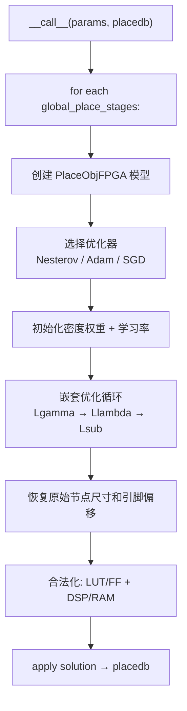
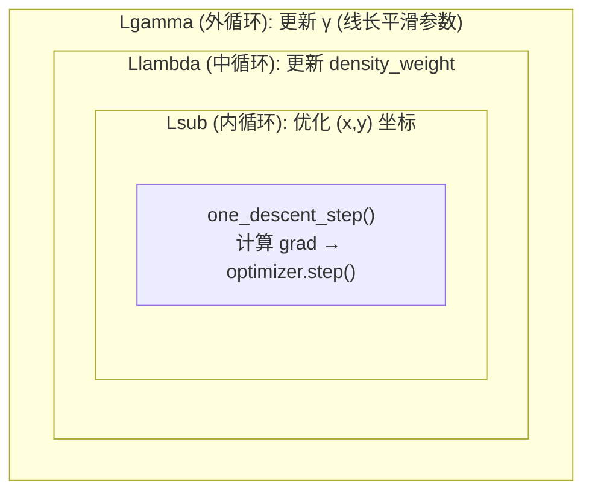
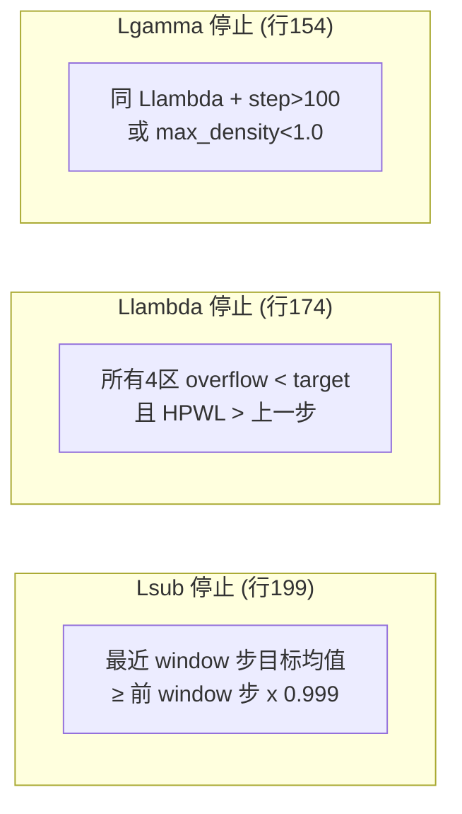
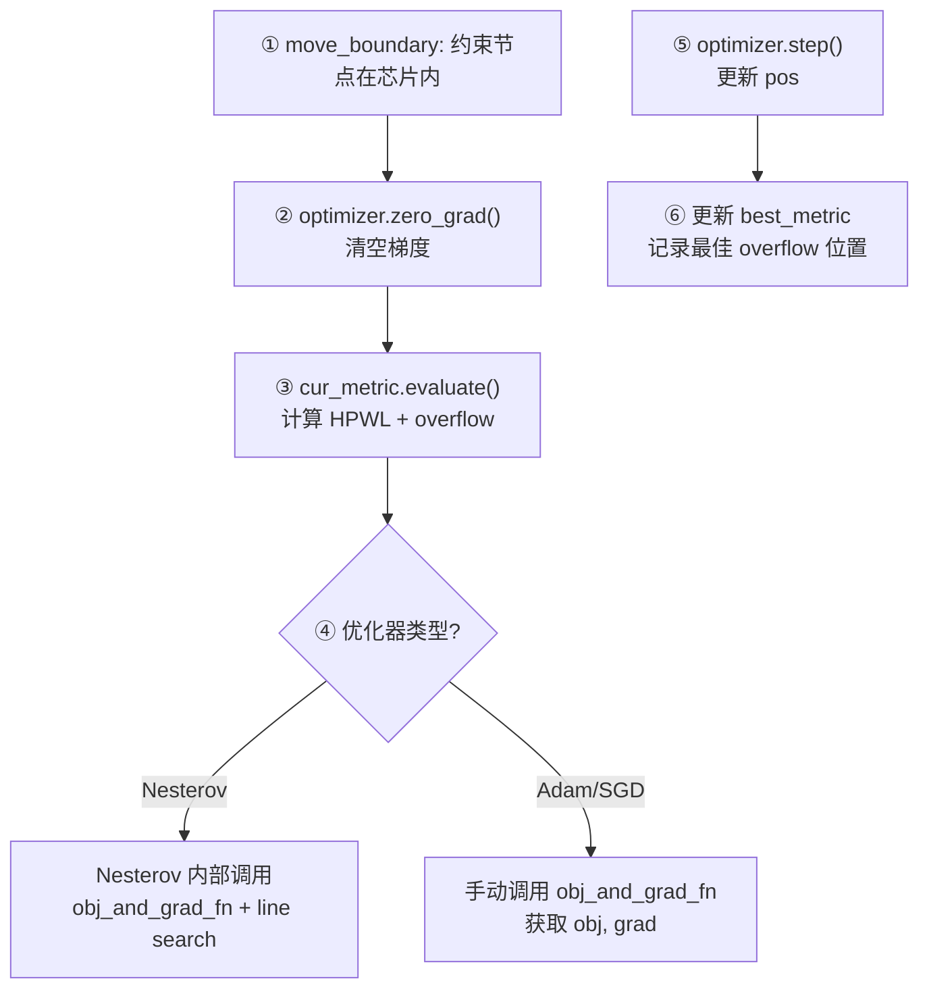
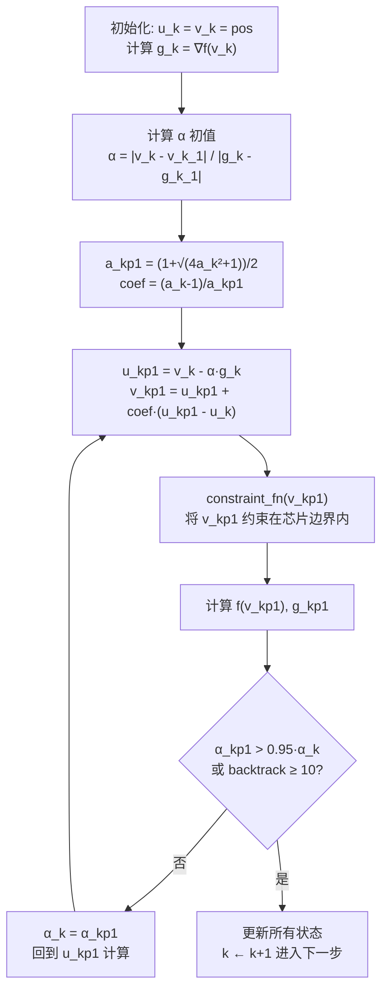
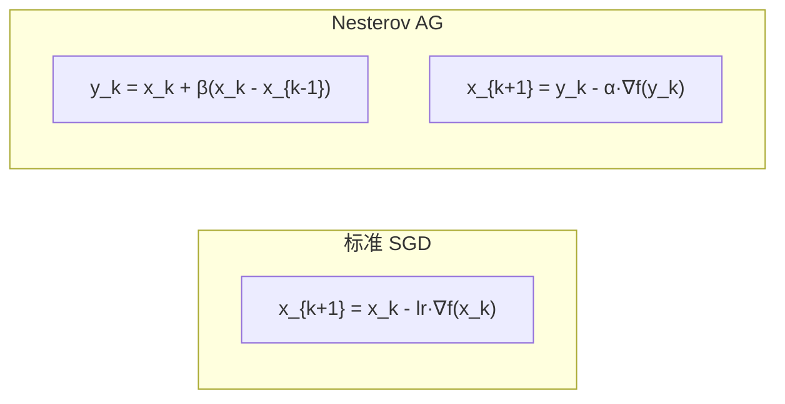
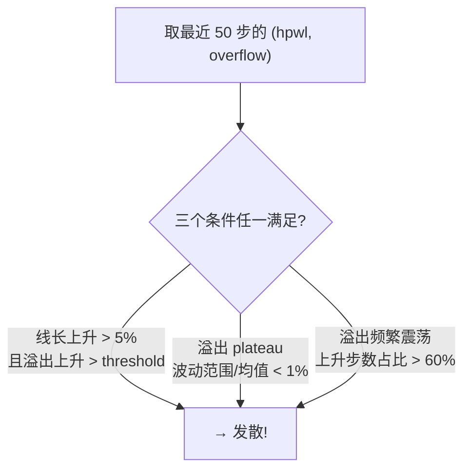
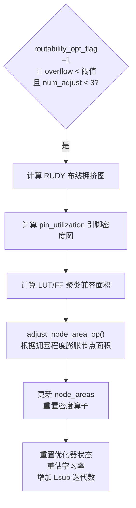
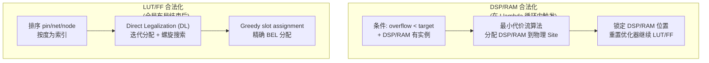
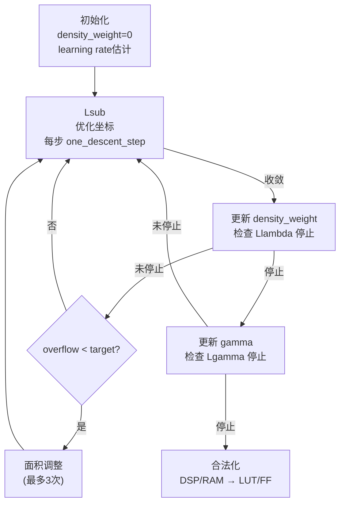

# Day 4: 非线性布局求解器 —— 嵌套优化循环与合法化

> **学习日期**: 2026-06-21
> **涉及文件**: `NonLinearPlace.py` (946行), `NesterovAcceleratedGradientOptimizer.py` (153行), `ops/lut_ff_legalization/`, `ops/dsp_ram_legalization/`
> **前置知识**: Day3 `PlaceObjFPGA` 目标函数 + 算子调用方式

---

## 目录

1. [整体结构：NonLinearPlaceFPGA.__call__](#1-整体结构nonlinearplacefpga__call__)
2. [嵌套优化：Lsub → Llambda → Lgamma](#2-嵌套优化lsub--llambda--lgamma)
3. [one_descent_step：一次迭代的内部细节](#3-one_descent_step一次迭代的内部细节)
4. [Nesterov 加速梯度优化器](#4-nesterov-加速梯度优化器)
5. [发散检测与自恢复机制](#5-发散检测与自恢复机制)
6. [面积调整：拥塞感知的资源膨胀](#6-面积调整拥塞感知的资源膨胀)
7. [合法化：LUT/FF + DSP/RAM](#7-合法化lutff--dspram)
8. [完整迭代日志解读](#8-完整迭代日志解读)
9. [核心概念速查](#9-核心概念速查)

---

## 1. 整体结构：NonLinearPlaceFPGA.__call__



`NonLinearPlaceFPGA` 继承自 `BasicPlaceFPGA`（Day3），`__call__` 是真正的求解器核心。代码 946 行，可分为**两大阶段**：

| 阶段 | 行数 | 内容 |
|------|------|------|
| 全局布局 | 53-709 | 嵌套优化 + 面积调整 + 发散恢复 |
| 合法化 | 780-895 | LUT/FF 直接合法化 (DL) + DSP/RAM 最小代价流 |

---

## 2. 嵌套优化：Lsub → Llambda → Lgamma

### 2.1 三层嵌套的结构



对应代码的三层 for 循环（第344-350行）：

```python
for Lgamma_step in range(model.Lgamma_iteration):          # 外: γ 更新
    for Llambda_density_weight_step in range(...):          # 中: λ 更新
        for Lsub_step in range(model.Lsub_iteration):       # 内: 坐标优化
            one_descent_step(...)
            # 检查 Lsub 停止条件
        # 检查 Llambda 停止条件 + 更新 density_weight
    # 检查 Lgamma 停止条件 + 更新 gamma
```

### 2.2 每一层的职责

| 层 | 优化变量 | 更新频率 | 停止条件 |
|----|---------|---------|---------|
| **Lsub** | `pos` (x,y 坐标) | 每步 | 目标函数 moving average 下降 < 0.1% |
| **Llambda** | `density_weight` (λ) | 每 Lsub_iteration 步 | 所有 region overflow < target 且 HPWL 上升 |
| **Lgamma** | `gamma` (γ) | 每 Llambda_iteration 步 | overflow < target 且 HPWL 上升 (>100步) |

### 2.3 三个停止条件函数



**关键思想**：外层优化的停止条件都依赖于**内层收敛且线长开始变差**——这意味着在密度约束满足后继续优化会损害线长质量。

---

## 3. one_descent_step：一次迭代的内部细节

> **代码位置**: `NonLinearPlace.py:215-281`



**关键细节**：

- 第 250-256 行：当某些 fence region 的 density_weight 停止更新时，**该区域的节点位置也被冻结**（回退到更新前的位置）
- 第 266-269 行：Nesterov 优化器的目标值在 `step()` 内部已计算完成，所以直接读取 `optimizer.param_groups[0]['obj_k_1']`

---

## 4. Nesterov 加速梯度优化器

> **文件**: `NesterovAcceleratedGradientOptimizer.py` (153行)
> **参考论文**: [ePlace-3D](http://cseweb.ucsd.edu/~jlu/papers/eplace-todaes14/paper.pdf) Algorithm 2

### 4.1 变量含义

| 变量 | 含义 |
|------|------|
| `u_k` | **主解** (major solution)，累加动量 |
| `v_k` | **参考解** (reference solution)，实际评估目标函数的位置 |
| `g_k` | 在 `v_k` 处的梯度 |
| `obj_k` | 在 `v_k` 处的目标值 |
| `a_k` | Nesterov 参数，控制动量系数 |
| `alpha_k` | 步长估计，由线搜索调整 |

### 4.2 核心算法流程



### 4.3 与标准优化器的对比



Nesterov 的两个关键创新：
- **动量外推**：先沿动量方向跳到 `y_k`，再计算梯度（比在 `x_k` 处算梯度更准确）
- **自适应步长**：通过线搜索自动调整 `α`，不需手动设置学习率

### 4.4 为什么 Nesterov 是默认选择

论文 (ePlace) 证明对于解析布局这种非凸优化问题，Nesterov 的线搜索机制比固定学习率更稳定。尤其是密度权重大幅变化时，Nesterov 能自动适应。

---

## 5. 发散检测与自恢复机制

布局优化是**非凸问题**，容易发散。代码中有三层防护：

### 5.1 最佳位置记录 (第274-279行)

```python
if best_metric[0] is None or best_metric[0].overflow > cur_metric.overflow:
    best_metric[0] = cur_metric
    best_pos[0] = self.pos[0].data.clone()  # 保存最佳位置
```

### 5.2 check_divergence (第289-316行)



### 5.3 发散后的恢复 (第354-360行)

```python
if check_divergence(...):
    self.pos[0].data.copy_(best_pos[0].data)  # 回退到最佳位置
    stop_placement = 1                          # 停止优化
    allow_update = 0                            # 冻结密度权重更新
```

### 5.4 阶段结束检查 (第697-705行)

每个 stage 结束时，比较最终结果与 best_metric，如果最终结果更差就回退。

---

## 6. 面积调整：拥塞感知的资源膨胀

> **代码位置**: 第412-481行

### 6.1 触发条件和流程



### 6.2 为什么需要面积调整

在高拥塞区域，标准密度约束不足以分散单元。通过**人为膨胀这些区域的节点面积**，密度势能会把单元推开，降低布线拥塞。

### 6.3 最多调整 3 次

`params.max_num_area_adjust = 3`。每次调整后优化器从头开始（reload `initial_state`），但节点位置保持当前最佳。

---

## 7. 合法化：LUT/FF + DSP/RAM

### 7.1 合法化总览



### 7.2 DSP/RAM 合法化 (第483-526行)

```python
# 在 Llambda 层检测条件
if overflow[0:4] 都 < targetOverflow:
    movVal = legalize_dsp(pos, placedb, region_id=2)  # DSP
    moVal  = legalize_ram(pos, placedb, region_id=3)  # RAM
    model.lock_mask[2:4] = True   # 锁定 DSP/RAM 区域
    # 重置优化器，继续优化 LUT/FF
```

DSP/RAM 合法化使用最小代价流算法（`legalize_cpp` C++ 实现）。

### 7.3 LUT/FF 直接合法化 (DL) (第840-895行)

```python
# 排序 —— 按度数建立索引
sortedNetIdx = sort(net2pincount_map)
sortedPinMap = sort(sortedNetMap[pin2net_map])
sortedNodeMap = sort(node2pinId0)

# 初始化 DL 算子
lut_ff_legalization_op.initialize(pos, precondWL, ...)

# 迭代 DL 循环
while DLStatus == 1:
    lut_ff_legalization_op.runDLIter(...)   # 一轮分配
    if activeStatus > 0:  DLStatus = 1       # 还有活跃的未分配节点
    elif illegalStatus > 0: DLStatus = -1    # 有冲突
    else: DLStatus = 0                       # 完成
    if dlIter > 100 or iter_stable > 5:      # 安全退出
        DLStatus = 0

# 最终 Greedy slot 分配
pos = lut_ff_legalization_op.ripUP_Greedy_slotAssign(pos, ...)
```

**DL 算法核心**：基于全局布局解，按节点尺寸和引脚连接关系，螺旋搜索最近的合法 SLICE Site，迭代分配直到所有 LUT/FF 都找到合法位置。

---

## 8. 完整迭代日志解读

运行一次 placement，你会看到类似这样的输出：

```
[INFO] use nesterov optimizer
iter:    0, HPWL 3.456789E+05, Overflow [2.345E-01, 1.987E-01, 1.234E-01, 8.901E-02], time 12.345ms
iter:    1, HPWL 3.412345E+05, Overflow [2.201E-01, 1.856E-01, 1.123E-01, 8.234E-01], time 11.987ms
...
[INFO] Lsub stopping criteria: 23 and 3.234E+05 > 3.231E+05 * 0.999
[INFO] Llambda stopping criteria: 5 and OVFL all < target and HPWL up
[INFO] Lgamma stopping criteria: 120 and ...
```

**解读**：
- `iter: 0` → 全局迭代编号
- `HPWL` → 半周长线长（越小越好）
- `Overflow [LUT, FF, DSP, RAM]` → 四种资源的溢出率，需要降到 `targetOverflow` 以下
- Lsub/Llambda/Lgamma 各有停止条件，满足时 break 出对应循环

---

## 9. 核心概念速查

### 9.1 优化循环的完整状态机



### 9.2 关键阈值汇总

| 阈值 | 默认值 | 作用 |
|------|--------|------|
| `stop_overflow` | 0.1 | 停止条件：overflow < 此值 |
| `node_area_adjust_overflow` | 0.15 | 面积调整触发 overflow 上限 |
| `timing_iteration_overflow` | 0.15 | 时序迭代触发 overflow 上限 |
| `max_num_area_adjust` | 3 | 最大面积调整次数 |
| `max_num_timing_iteration` | 20 | 最大时序迭代次数 |
| `Lsub_iteration` | 1 (默认) | 内循环迭代次数 |
| `Llambda_density_weight_iteration` | 1 (默认) | 密度权重更新间隔 |

### 9.3 Nesterov 状态变量

```
每个 param_group 中存储:
├── u_k, v_k      # 主解和参考解 (Tensor, 尺寸 = num_nodes*2)
├── g_k, obj_k    # v_k 处的梯度和目标值
├── g_k_1, obj_k_1 # 上一步的梯度和目标值
├── v_k_1         # 上一步的参考解
├── a_k           # Nesterov 动量参数
└── alpha_k       # 自适应步长
```

---

## 📚 第五天预告

深入时序驱动布局：

- `Timer.py` 时序模型：逻辑延迟 + 线延迟
- `TimingGraph` 时序图构建
- `timing` 算子：STA 分析与关键路径反馈
- `timing_net_wirelength` 算子
- `PrecondTiming` 时序预条件子
