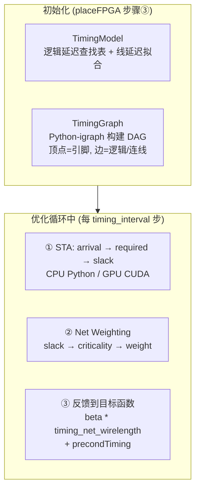
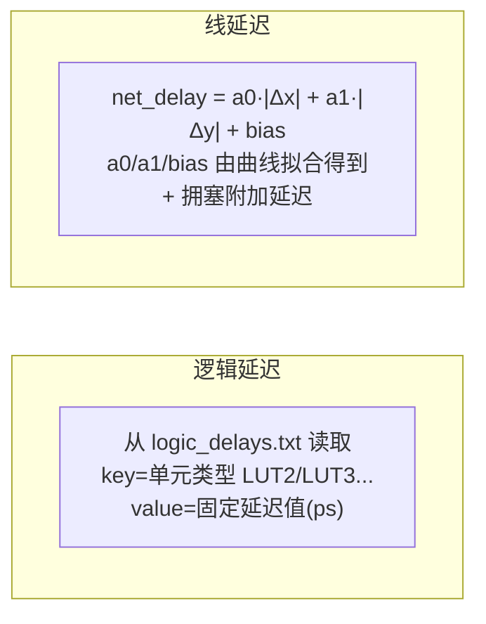
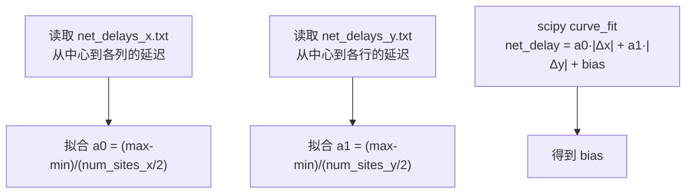
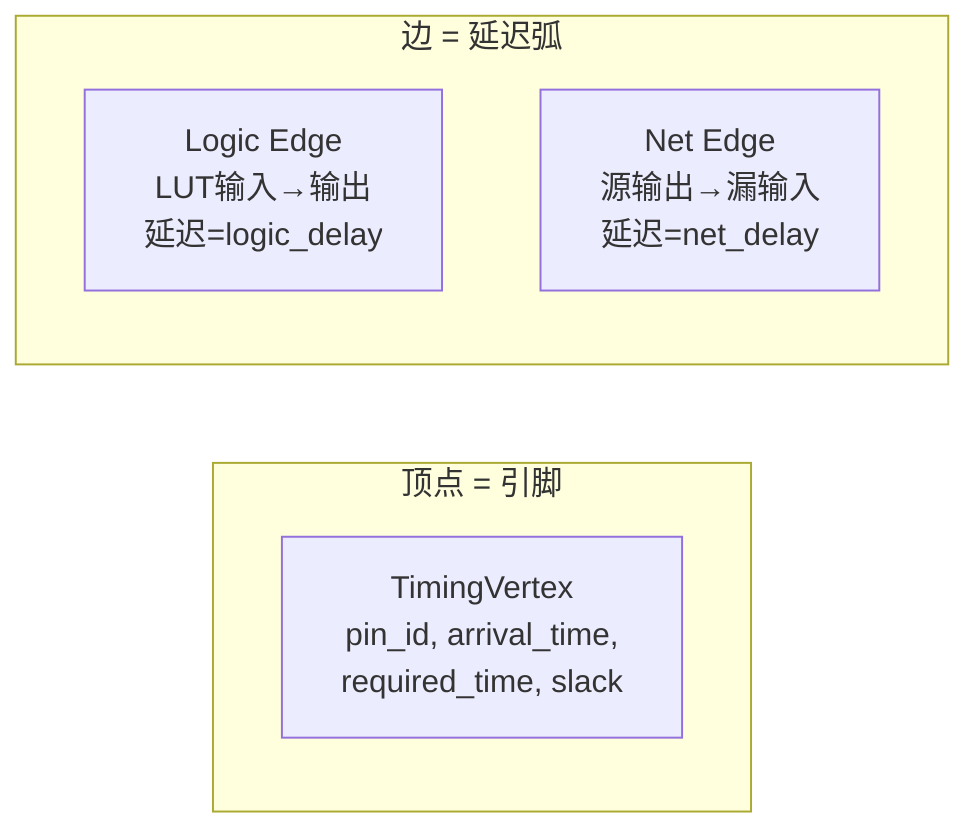
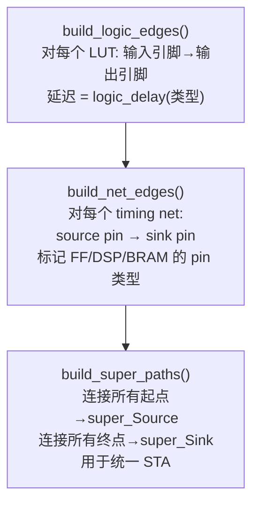
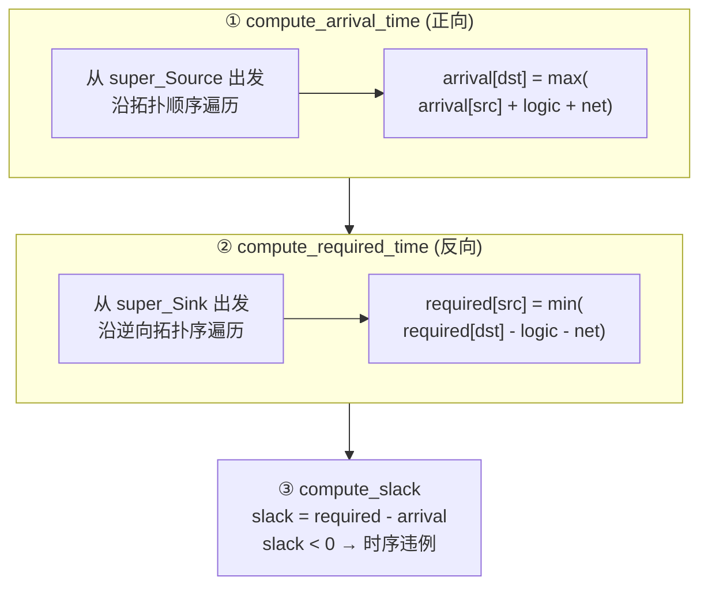
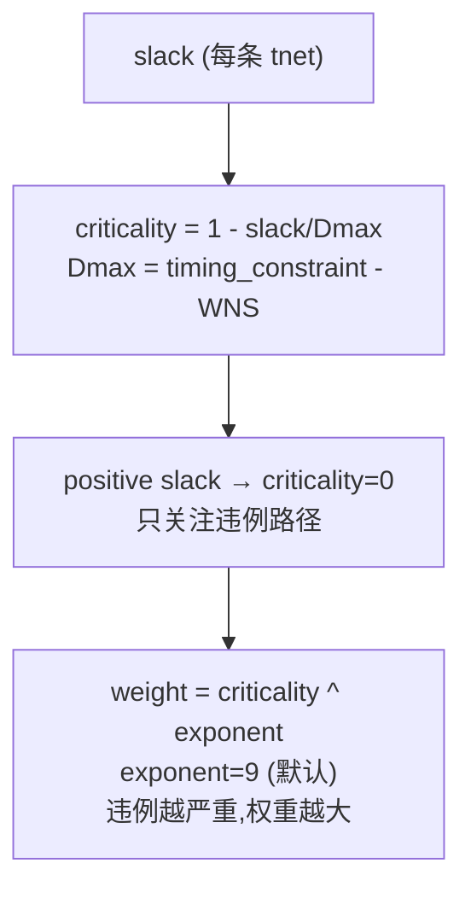
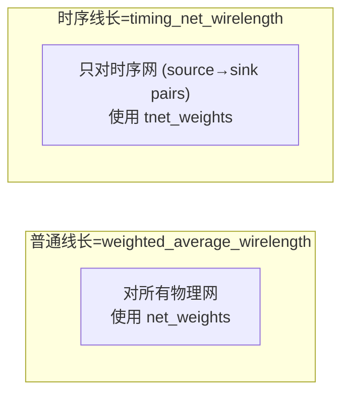
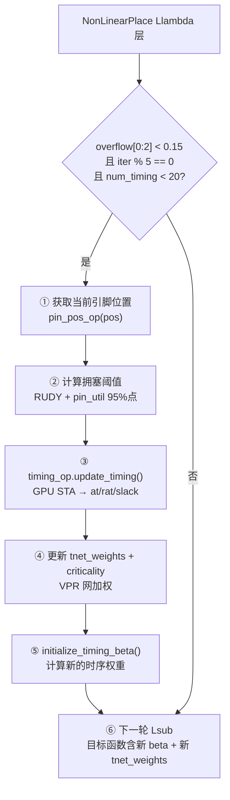
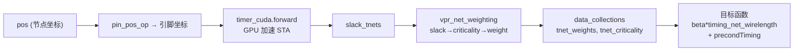

# Day 5: 时序驱动布局 —— STA 分析与关键路径优化

> **学习日期**: 2026-06-21
> **涉及文件**: `Timer.py` (193行), `ops/timing/timing_graph.py` (717行), `ops/timing/timing.py` (281行), `ops/timing_net_wirelength/`, `ops/precondTiming/`
> **前置知识**: Day3 `PlaceObjFPGA` 目标函数 (含 beta*时序项), Day4 `NonLinearPlaceFPGA` 优化循环中时序触发

---

## 目录

1. [时序驱动布局的总览](#1-时序驱动布局的总览)
2. [TimingModel：延迟模型的建立](#2-timingmodel延迟模型的建立)
3. [TimingGraph：时序图的构建](#3-timinggraph时序图的构建)
4. [STA：静态时序分析三步骤](#4-sta静态时序分析三步骤)
5. [网加权：从 Slack 到 Net Weight](#5-网加权从-slack-到-net-weight)
6. [时序网线长：TimingNetWirelength](#6-时序网线长timingnetwirelength)
7. [时序预条件子：PrecondTiming](#7-时序预条件子precondtiming)
8. [时序驱动流程在 NonLinearPlace 中的嵌入](#8-时序驱动流程在-nonlinearplace-中的嵌入)
9. [核心概念速查](#9-核心概念速查)

---

## 1. 时序驱动布局的总览



**核心思想**：在全局布局优化过程中，定期运行 STA（静态时序分析），找出关键路径，提高关键路径上网的权重，使布局器优先缩短这些网的线长。

### 触发条件（NonLinearPlace.py:380）

```python
if (timing_driven_flag
    and num_timing_iteration < max_num_timing_iteration  # < 20
    and overflow < timing_iteration_overflow              # LUT/FF overflow < 0.15
    and iteration % timing_interval == 0):                # 每 5 步
    # 执行一次时序迭代
```

---

## 2. TimingModel：延迟模型的建立

> **文件**: `Timer.py:54-191`

### 2.1 两种延迟来源



### 2.2 逻辑延迟查找表

```python
def build_logic_delay_lookup(self):
    with open("timing/ultrascale/logic_delays.txt", 'r') as fin:
        for line in fin:
            key, value = line.split()
            self.delay_logic[key] = int(value)
    # 例如: delay_logic["LUT2"] = 200  (ps)
```

### 2.3 线延迟的线性拟合



`curve_fit_linear()` (第134-189行) 使用 `scipy.optimize.curve_fit` 对实际延迟数据进行线性回归，得到三个参数 `(a0, a1, bias)`。

### 2.4 拥塞附加延迟

```python
def get_congestion_delay(src_x, src_y, sink_x, sink_y,
                         route_util, pin_util, route_thresh, pin_thresh):
    # 计算 bounding box 内的平均拥塞
    route_avg = route_util[xl:xh+1, yl:yh+1].sum() / grid_area
    pin_avg = pin_util[xl:xh+1, yl:yh+1].sum() / grid_area
    # 如果超过阈值，增加拥塞延迟
    if route_avg > route_thresh and pin_avg > pin_thresh:
        return d_r * route_avg + d_p * pin_avg  # 1000*route + 50*pin
```

---

## 3. TimingGraph：时序图的构建

> **文件**: `ops/timing/timing_graph.py` (717行)

### 3.1 图的定义



这是一个**有向无环图 (DAG)**，使用 Python `igraph` 库构建。

### 3.2 构建三步骤



### 3.3 关键数据结构

```python
# TimingVertex: 时序顶点
class TimingVertex:
    pin_id         # 对应的物理引脚 ID
    arrival_time   # 信号到达时间 (正向传播 → max)
    required_time  # 要求到达时间 (反向传播 → min)
    slack          # = required_time - arrival_time
    is_flop_in     # 是否是 FF 输入 (时序路径终点)
    is_flop_out    # 是否是 FF 输出 (时序路径起点)

# TimingEdge: 时序边
class TimingEdge:
    src_node, dst_node  # 源/漏顶点
    tnet_id             # 对应的时序网 ID
    logic_delay         # 逻辑延迟 (LUT 内部)
    net_delay           # 线延迟 (源到漏的连线)
    slack               # 边的 slack
```

### 3.4 时序网与物理网的关系

```
timing net (tnet) → 物理网 (net) 是一对一的映射
tnet2net[tnet_id] = net_id

但一个物理网可能有多个 timing net:
  物理网 net_A 连接 {driver, load1, load2, load3}
  → 3 个 timing net:
    tnet_1: driver → load1
    tnet_2: driver → load2
    tnet_3: driver → load3
```

每条 `flat_tnet2pin` 存储：`[src_pin, sink_pin, src_pin, sink_pin, ...]`（每对 2 个值）。

---

## 4. STA：静态时序分析三步骤

### 4.1 流程图



### 4.2 GPU 加速的 STA

`timing.py` 中的 `update_timing()` 方法调用 CUDA kernel 来做 STA：

```python
if pos.is_cuda:
    at_vertices, rat_vertices, slack_tnets = timer_cuda.forward(
        pos, vertex2pin, tnet2src, tnet2dst, pin2node_map,
        flat_levelized_vertices, ...)
```

**为什么 GPU 加速 STA？** 大型设计可能有数十万条时序路径。GPU 的 levelized 并行（同 level 的顶点并行处理）可以显著加速。

### 4.3 WNS 和 TNS

```
WNS = Worst Negative Slack = min(0, 所有端点 slack 的最小值)
TNS = Total Negative Slack  = sum(min(0, slack) for each endpoint)

例如:
  WNS = -50ps → 最差路径慢了 50ps
  TNS = -200ps → 所有违例路径累计慢了 200ps
```

---

## 5. 网加权：从 Slack 到 Net Weight

> **文件**: `ops/timing/timing.py:261-277`

### 5.1 VPR 网加权算法



代码实现：

```python
def vpr_net_weighting(timer, num_tnets, slack_tnets, wns, criticality_exp, device):
    Dmax = timer.tgraph.timing_constraint - wns
    upd = torch.zeros(2*num_tnets)

    # 只对负 slack 计算
    positive_slack_mask = slack_tnets >= 0
    slack_masked = slack_tnets.masked_fill(positive_slack_mask, 0)

    # 前 num_tnets: tnet_weights
    # 后 num_tnets: tnet_criticality
    upd[num_tnets:] = 1 - slack_masked / Dmax        # criticality
    upd[:num_tnets] = upd[num_tnets:] ** criticality_exp  # weight

    return upd
```

### 5.2 criticality_exponent 的作用

```
exponent=1:   slack=-50ps → crit=0.5 → weight=0.5
exponent=9:   slack=-50ps → crit=0.5 → weight=0.5^9 ≈ 0.002
              slack=-200ps → crit=0.8 → weight=0.8^9 ≈ 0.134
```

高 exponent 使得**只有最关键的路径被显著加权**，避免过度约束。

---

## 6. 时序网线长：TimingNetWirelength

> **文件**: `ops/timing_net_wirelength/timing_net_wirelength.py` (149行)

### 6.1 与普通线长的关系



两者在目标函数中加权求和：

```python
# PlaceObj.py:245
result = wirelength + density_weight_u.dot(density) + beta * tnet_wirelength
```

### 6.2 计算方式

使用加权平均线长（Weighted Average WL），与普通线长算子相同的内核，只是输入的网表是 `flat_tnet2pin`（每对 source→sink 是一条"网"）。

### 6.3 beta 的初始化

```python
# PlaceObj.py:422-454
def initialize_timing_beta(params, placedb, num_timing_iteration):
    wirelength_grad_norm = grad of WL at current pos
    tnet_wirelength_grad_norm = grad of TWL at current pos

    beta_ratio = 0.1 + 0.1 * (num_timing_iteration - 1)  # 逐步增加
    beta_ratio = min(beta_ratio, params.beta_ratio)       # 上限 1.1

    beta = beta_ratio * wirelength_grad_norm / tnet_wirelength_grad_norm
```

**思想**：平衡时序梯度与线长梯度的量级，避免时序项主导优化。

---

## 7. 时序预条件子：PrecondTiming

> **文件**: `ops/precondTiming/precondTiming.py` (83行)

### 7.1 作用

预条件子（Preconditioner）加速梯度下降的收敛。时序预条件子为每个节点计算一个标量值，用于缩放该节点的梯度：

```python
# PlaceObj.py:74 (PreconditionOpFPGA.__call__)
precond = precondWL + node_areas + precondTiming
precond.clamp_(min=1.0)
grad /= precond   # 大预条件值 → 梯度缩小 → 小步移动
```

### 7.2 计算方式

```python
# precondTiming.forward(beta, tnet_weights)
# 为每个节点计算: beta * sum(相邻时序网的 tnet_weight)
```

**直觉**：如果一个节点连接了很多高权重时序网，它的预条件值大 → 梯度被缩小 → 移动更保守（因为移动它会影响很多关键路径）。这相当于在梯度空间中做了**各向异性缩放**。

---

## 8. 时序驱动流程在 NonLinearPlace 中的嵌入

### 8.1 完整时序迭代



### 8.2 时序数据流



---

## 9. 核心概念速查

### 9.1 时序相关的关键参数

| 参数 | 默认值 | 含义 |
|------|--------|------|
| `timing_driven_flag` | 0 | 是否启用时序驱动 |
| `timing_iteration_overflow` | 0.15 | LUT/FF overflow 低到此值才开始时序 |
| `max_num_timing_iteration` | 20 | 最大时序迭代次数 |
| `timing_interval` | 5 | 每 N 个 Llambda 迭代运行一次时序 |
| `criticality_exponent` | 9.0 | VPR 加权指数 |
| `beta_ratio` | 1.1 | 时序梯度与线长梯度的最大比例 |
| `timing_constraint` | 用户指定 | 目标时钟周期 (ps) |

### 9.2 目标函数中的时序项

```
obj = WL(pos) + Σ λ_k · D_k(pos) + β · TWL(pos, tnet_weights)

其中:
  WL = weighted_average 线长 (所有物理网, 平滑近似)
  D_k = 每个 fence region 的密度代价
  TWL = weighted_average 线长 (只针对时序网, 带 tnet_weights)
  β = 自适应时序权重
```

### 9.3 时序系统的两层

| 层 | Python 实现 | GPU 加速 |
|----|------------|---------|
| 时序图构建 | `TimingGraph` (igraph) | 无 |
| STA 计算 | `update_timing_old()` (Python) | `timer_cuda.forward` (CUDA) |
| 网加权 | `vpr_net_weighting` (torch ops) | 向量化 |
| 线长计算 | `TimingNetWirelength` | CUDA kernel |
| 预条件子 | `PrecondTiming` | CUDA kernel |

---

## 📚 第六天预告

深入 GPU 加速算子细节：

- `electric_potential` 电场势能密度算子的完整走读
- `weighted_average_wirelength` 线长算子
- `dct` 离散余弦变换（密度求解的核心数值方法）
- CUDA kernel 优化技巧：内存合并、共享内存、原子操作
