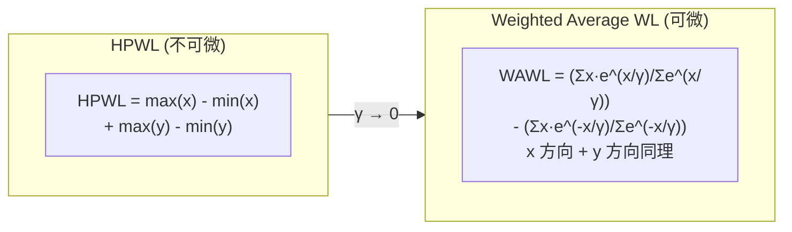
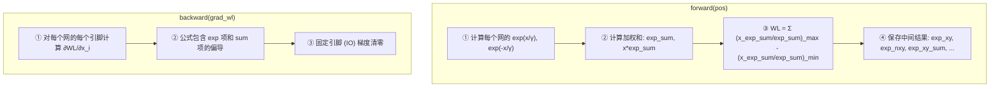
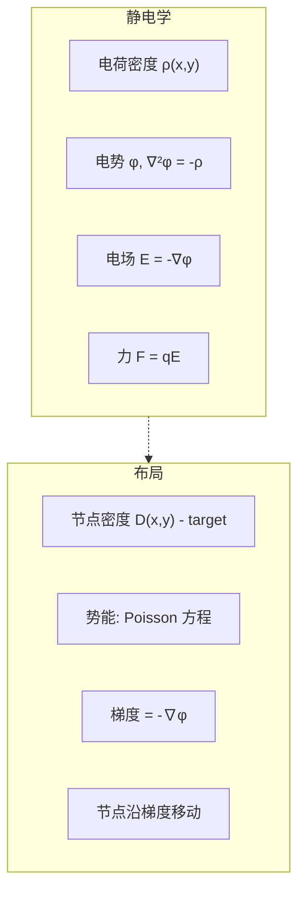
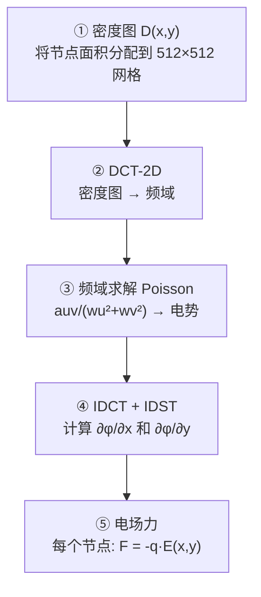
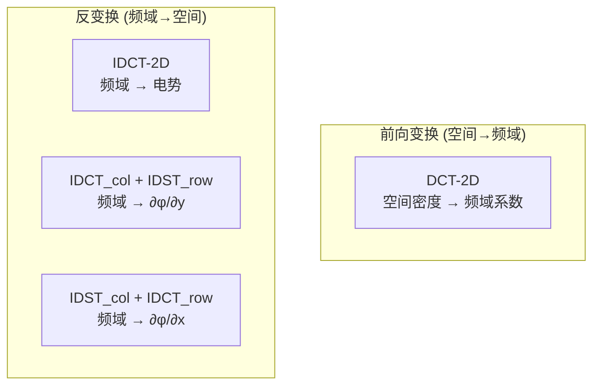
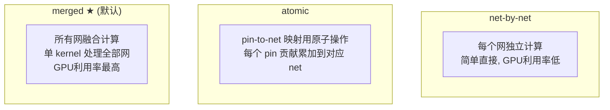

# Day 6: GPU 加速核心算子深度解析

> **学习日期**: 2026-06-21
> **涉及文件**: `ops/electric_potential/`, `ops/weighted_average_wirelength/`, `ops/dct/`
> **前置知识**: Day3 算子统一架构, Day4 目标函数中的 WL + density 项

---

## 目录

1. [目标函数算子的数学基础](#1-目标函数算子的数学基础)
2. [Weighted Average Wirelength：平滑线长](#2-weighted-average-wirelength平滑线长)
3. [Electric Potential：电场密度模型](#3-electric-potential电场密度模型)
4. [DCT/FFT：频域泊松求解器](#4-dctfft频域泊松求解器)
5. [线长算子的三种 GPU 算法](#5-线长算子的三种-gpu-算法)
6. [核心概念速查](#6-核心概念速查)

---

## 1. 目标函数算子的数学基础

回顾 Day4 的目标函数：

```
obj = wirelength(pos) + Σ λ·density(pos) + β·timing_wl(pos)
                       ↑                    ↑
              今天重点: WL算子          今天重点: 密度算子
```

两个核心算子分别求解**两个不同的物理类比问题**：

| 算子 | 物理类比 | 数学形式 |
|------|---------|---------|
| Weighted Average WL | 无 | exp-weighted smooth max/min |
| Electric Potential | 静电势能 | Poisson 方程 ∇²φ = -ρ |

---

## 2. Weighted Average Wirelength：平滑线长

### 2.1 从 HPWL 到平滑近似

HPWL（半周长线长）不可微（在 bounding box 边界处有跳跃），需要用平滑函数替代：



**γ（gamma）** 控制平滑度：
- γ 大 → 线长函数更平滑，优化更容易但近似不精确
- γ 小 → 更接近 HPWL，但优化更难

### 2.2 数学公式

对于一个网 `e` 上的引脚集合 `{p_i}`，加权平均线长：

$$WL(e) = \frac{\sum x_i \cdot e^{x_i/\gamma}}{\sum e^{x_i/\gamma}} - \frac{\sum x_i \cdot e^{-x_i/\gamma}}{\sum e^{-x_i/\gamma}}$$

第一项近似 `max(x)`，第二项近似 `min(x)`。当 `γ → 0` 时精确等于 HPWL。

### 2.3 Forward/Backward 流程



### 2.4 CUDA kernel 中的关键优化

前向传播中的 6 个中间量存储在 `ctx` 中传给 backward：

```python
ctx.exp_xy = output[1]      # exp(x/γ) values per pin
ctx.exp_nxy = output[2]     # exp(-x/γ) values per pin
ctx.exp_xy_sum = output[3]  # sum of exp(x/γ) per net
ctx.exp_nxy_sum = output[4] # sum of exp(-x/γ) per net
ctx.xyexp_xy_sum = output[5] # sum of x*exp(x/γ) per net
ctx.xyexp_nxy_sum = output[6] # sum of x*exp(-x/γ) per net
```

---

## 3. Electric Potential：电场密度模型

> **参考论文**: [ePlace-3D](http://cseweb.ucsd.edu/~jlu/papers/eplace-todaes14/paper.pdf)

### 3.1 物理类比



**思想**：把每个节点看作带正电荷的粒子，密度过高处产生排斥力，节点沿电场方向移动以降低密度。

### 3.2 电场算子的完整计算流程



### 3.3 Forward 函数详解 (electric_potential.py:47-174)

```python
# Step 1: 构建密度图 (在 bin 网格上)
density_map = ElectricDensityMapFunction.forward(
    pos, node_size_x, node_size_y, offset_x, offset_y,
    ratio, initial_density_map,
    xl, yl, xh, yh, bin_size_x, bin_size_y, ...)

# Step 2: 归一化
density_map /= (bin_size_x * bin_size_y)

# Step 3: 2D DCT 变换 → 频域系数 auv
auv = dct2.forward(density_map)

# Step 4: 频域求解 → auv/(wu²+wv²)
auv_by_wu2_plus_wv2 = auv * inv_wu2_plus_wv2

# Step 5: 反变换得 ∂φ/∂x (field_map_x) 和 ∂φ/∂y (field_map_y)
# IDCT_along_col + IDST_along_row 的混合变换
ctx.field_map_x = idxst_idct.forward(auv * wu_by_wu2_plus_wv2_half)
ctx.field_map_y = idct_idxst.forward(auv * wv_by_wu2_plus_wv2_half)

# Step 6: 2D IDCT → 势能图
potential_map = idct2.forward(auv_by_wu2_plus_wv2)

# Step 7: 能量 = Σ 势能 × 密度
energy = (potential_map * density_map).sum()
```

### 3.4 Backward：电场力

```python
# 对每个节点，采样 field_map_x 和 field_map_y 在节点位置处的值
output = -electric_potential_cuda.electric_force_fpga(
    grad_pos, num_bins_x, num_bins_y,
    field_map_x, field_map_y,   # ← 前向计算保存的电场
    pos, node_size_x, node_size_y,
    bin_size_x, bin_size_y, num_movable_nodes, ...)
```

**Backward 不做 DCT！** 因为前向已保存了 `field_map_x` 和 `field_map_y`，反向传播只需要**插值采样**电场在每个节点位置的值。

### 3.5 为什么用 DCT（离散余弦变换）

电场问题在频域求解更高效：

- 空间域的泊松方程 `∇²φ = -ρ` 在频域变为代数运算 `auv[kx,ky] / (kx²+ky²)`
- DCT 隐式满足 Neumann 边界条件（边界外电场为零）→ 自动处理芯片边界
- 2D DCT 可通过 1D FFT 实现 → O(MN log(MN))，远快于直接求解

---

## 4. DCT/FFT：频域泊松求解器

> **文件**: `ops/dct/dct.py` (400行)

### 4.1 DCT 类型一览



### 4.2 四种混合反变换

频域中的 `auv × wu/(wu²+wv²)` 回到空间域需要**混合变换**：

```python
# ∂φ/∂x: 先用 DCT 再 DST
self.field_map_x = idxst_idct(auv * wu/(wu²+wv²)/2)
# = IDST_along_columns(IDCT_along_rows(auv * wu/(wu²+wv²)/2))

# ∂φ/∂y: 先用 DST 再 DCT
self.field_map_y = idct_idxst(auv * wv/(wu²+wv²)/2)
# = IDCT_along_columns(IDST_along_rows(auv * wv/(wu²+wv²)/2))

# 电势本身: 纯 DCT
potential_map = idct2(auv/(wu²+wv²))
# = IDCT_along_rows(IDCT_along_columns(auv/(wu²+wv²)))
```

### 4.3 CUDA Kernel 中的 DCT 实现

DCT 通过 FFT 实现（`dct_cuda_kernel.cu`）：

```
DCT(x) = FFT( x_padded_to_2N ) × expk
```

核心 kernel `computeMulExpk` 将 FFT 的复数结果乘以 `exp(-jπk/2N)` 转为 DCT 系数。

---

## 5. 线长算子的三种 GPU 算法

`WeightedAverageWirelength` 支持三种算法（`.py:266-338`）：



| 算法 | 优点 | 缺点 |
|------|------|------|
| net-by-net | 实现简单 | GPU 利用率低，小网多时很差 |
| atomic | 中等并行度 | 原子操作有竞争开销 |
| **merged** | **最高 GPU 利用率** | 实现复杂，需要额外的排序 |

DREAMPlaceFPGA 默认使用 `merged` 算法。

---

## 6. 核心概念速查

### 6.1 两个核心算子的对比

| 维度 | Weighted Average WL | Electric Potential |
|------|-------------------|-------------------|
| 类比 | 无 (纯数值) | 静电学 |
| 核心数值方法 | exp/log + reduction | DCT/FFT + 频域求解 |
| 离散化维度 | 逐网计算 | 512×512 grid |
| 前向复杂度 | O(#pins) | O(MN log MN) (DCT) |
| 反向复杂度 | O(#pins) | O(#nodes) (仅插值采样!) |
| 存储中间量 | 6个 per-pin/per-net 标量 | 2个 field_map [M×N] |

### 6.2 DCT 变换的频域对应关系

```
空间域                         频域
──────────────────────────────────────────────
density_map(x,y)   ──DCT2──▶  auv(kx,ky)
                                  │
                    ──÷(wu²+wv²)─▶  (频域除法 = 空间域解泊松)
                                  │
                                  ▼  auv/(wu²+wv²)
            ◀──IDCT2──   potential_map(x,y)   ← 电势

∂φ/∂x  ◀──IDXST_IDCT──  auv·wu/(wu²+wv²)/2
∂φ/∂y  ◀──IDCT_IDXST──  auv·wv/(wu²+wv²)/2
```

### 6.3 gamma 的双重角色

`gamma` 同时影响两个算子：
- **线长**：`inv_gamma = 1/gamma`，gamma 大 → inv_gamma 小 → 线长近似更平滑
- **密度**：通过 `wu` 和 `wv` 的缩放 `ar = bin_size_x/bin_size_y * xWt/yWt` 间接影响

---

## 📚 第七天预告

深入 RUDY 布线拥塞估计 & 引脚密度优化：

- `rudy` 算子：基于 bounding box 的快速布线需求估计
- `pin_utilization` 算子：引脚密度图
- `adjust_node_area`：拥塞感知的面积膨胀全流程
- `clustering_compatibility`：LUT/FF 聚类的兼容性约束
