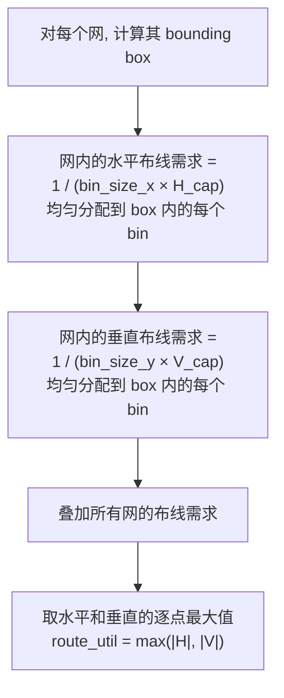
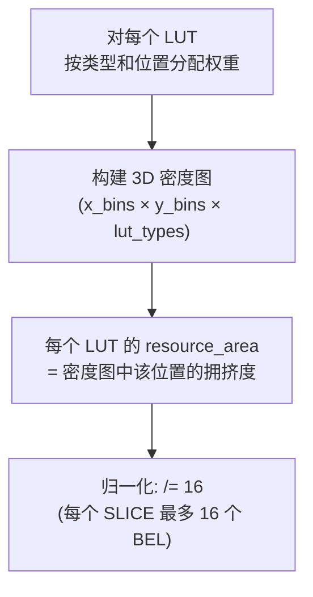
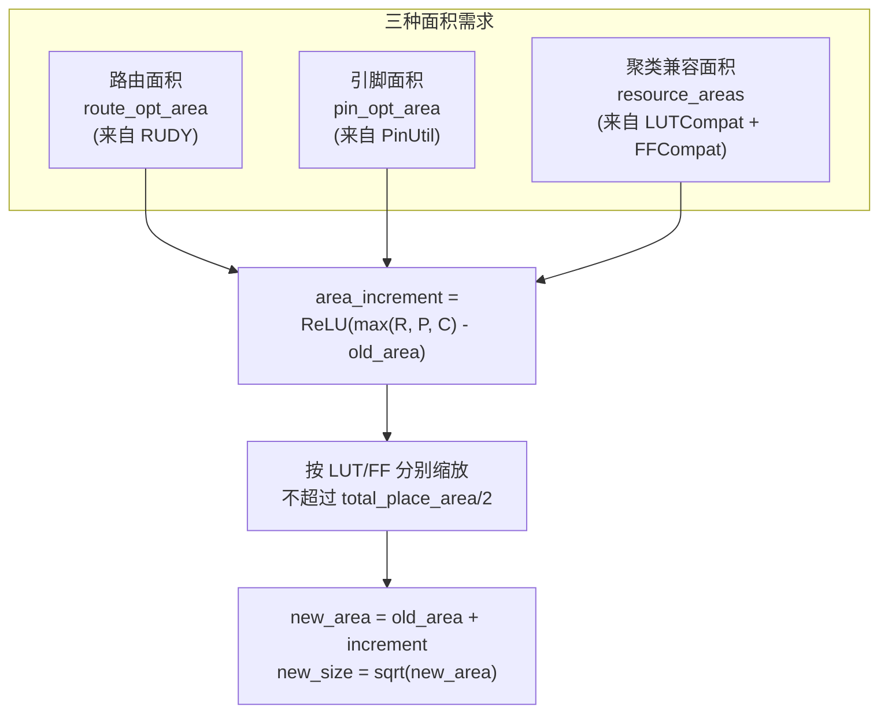
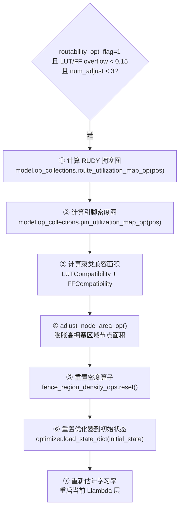
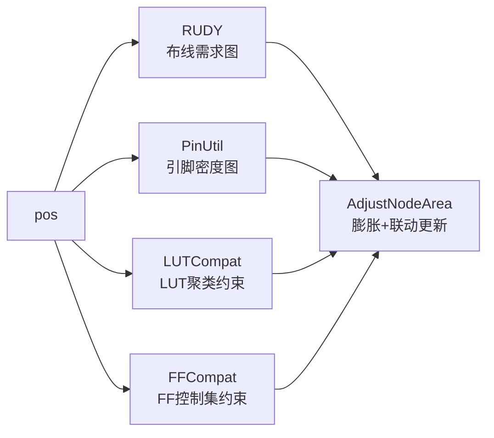

# Day 7: 布线拥塞估计与面积调整 —— 从拥塞感知到资源膨胀

> **学习日期**: 2026-06-21
> **涉及文件**: `ops/rudy/`, `ops/pin_utilization/`, `ops/adjust_node_area/`, `ops/clustering_compatibility/`
> **前置知识**: Day4 面积调整触发条件, Day6 密度/线长核心算子

---

## 目录

1. [拥塞感知布局的动机](#1-拥塞感知布局的动机)
2. [RUDY：快速布线需求估计](#2-rudy快速布线需求估计)
3. [Pin Utilization：引脚密度图](#3-pin-utilization引脚密度图)
4. [Clustering Compatibility：LUT/FF 聚类约束](#4-clustering-compatibilitylutff-聚类约束)
5. [AdjustNodeArea：拥塞感知的面积膨胀](#5-adjustnodearea拥塞感知的面积膨胀)
6. [面积调整完整流程](#6-面积调整完整流程)
7. [核心概念速查](#7-核心概念速查)

---

## 1. 拥塞感知布局的动机


**核心思想**：在高拥塞区域人为膨胀节点面积，密度势能会把节点推开，从而降低局部布线/引脚密度。

---

## 2. RUDY：快速布线需求估计

> **文件**: `ops/rudy/rudy.py` (107行)
> **全称**: Rectangular Uniform wire DensitY

### 2.1 算法原理



**RUDY 的 "矩形均匀" 假设**：网在 bounding box 内所有 bin 的布线概率**均匀分布**。这是一种快速近似，精确的布线概率估计需要更复杂的模型（如 RISA）。

### 2.2 代码实现要点

```python
# rudy.py forward()
# Step 1: CUDA kernel 计算水平和垂直布线需求图
rudy_cuda.forward(pin_pos, netpin_start, flat_netpin, net_weights,
                  bin_size_x, bin_size_y, ..., h_map, v_map)

# Step 2: 归一化为利用率 (demand / capacity)
bin_area = bin_size_x * bin_size_y
h_map /= (bin_area * unit_horizontal_capacity)  # 209 tracks per unit
v_map /= (bin_area * unit_vertical_capacity)    # 239 tracks per unit

# Step 3: L∞ 范数 → 单张拥塞图
route_utilization_map = max(abs(h_map), abs(v_map))
```

### 2.3 结果解读

```
route_utilization_map[i,j] < 1.0  → 布线资源充足
route_utilization_map[i,j] = 1.0  → 刚好满
route_utilization_map[i,j] > 1.0  → 拥塞! 需求超过供给
```

---

## 3. Pin Utilization：引脚密度图

> **文件**: `ops/pin_utilization/pin_utilization.py` (107行)

### 3.1 与 RUDY 的区别

| 维度 | RUDY | Pin Utilization |
|------|------|-----------------|
| 估计对象 | 布线轨道需求 | 引脚密度 |
| 约束 | `unit_horizontal/vertical_capacity` | `unit_pin_capacity` |
| 平滑方式 | 网 bounding box 均匀分布 | 节点面积拉伸 (clamp min) |
| 最终图 | `max(abs(H), abs(V))` | 直接引脚密度图 |

### 3.2 面积拉伸

```python
# 每个节点的引脚被"拉伸"到一个最小面积
half_stretch_x = 0.5 * node_size_x.clamp(min=bin_size_x * pin_stretch_ratio)
half_stretch_y = 0.5 * node_size_y.clamp(min=bin_size_y * pin_stretch_ratio)
```

`pin_stretch_ratio = 1.414`（默认），确保小节点（如单个 FF）的引脚密度也在网格上合理分布。

---

## 4. Clustering Compatibility：LUT/FF 聚类约束

> **文件**: `ops/clustering_compatibility/clustering_compatibility.py` (202行)

### 4.1 问题背景

在 Xilinx UltraScale 架构中：
- **1 个 SLICE** = 最多 8 个 LUT + 16 个 FF
- LUT 有不同输入数 (LUT2/LUT3/.../LUT6)，不同类型**不能**放在同一 SLICE 中
- FF 受控制集 (Clock/Set-Reset/Clock-Enable) 约束，**不同控制集的 FF 不能**放在同一 SLICE

### 4.2 LUTCompatibility



**如果某个区域 LUT3 密度过高，该区域 LUT3 的 resource_area 会增大 → AdjustNodeArea 会膨胀它们的面积 → 密度力推开多余的 LUT3**。

### 4.3 FFCompatibility

类似 LUT，但维度是 `(x_bins × y_bins × ck_bins × ce_bins)` —— 按控制集 (Clock, Clock-Enable) 分类：

```python
# FF 控制集信息编码在 flop_ctrlSets 中
# (flop_index, cksr_id, ce_id) 三元组
# cksr_id 编码了 (clock_net, set_reset_net) 的组合
```

---

## 5. AdjustNodeArea：拥塞感知的面积膨胀

> **文件**: `ops/adjust_node_area/adjust_node_area.py` (374行)

### 5.1 三种面积膨胀源的融合



### 5.2 关键步骤

```python
# Step 1: 对拥塞图做指数拉伸 (增强差异)
route_utilization_map.pow(route_opt_adjust_exponent)  # exponent=2.0
    .clamp(min=1/max_rate, max=max_rate)              # 限幅 [0.5, 2.0]

# Step 2: 从拥塞图采样每个节点的面积需求
route_opt_area = compute_node_area_route(pos, node_size_x, node_size_y,
                                          route_utilization_map_clamp)

# Step 3: 取最大值作为面积增量 (最差拥塞决定)
area_increment = ReLU(max(resource_areas, route_opt_area, pin_opt_area) - old_area)

# Step 4: 检查是否需要停止
if area_increment_ratio < area_adjust_stop_ratio: # 0.01
    return False  # 面积变化太小, 停止调整
```

### 5.3 面积调整后的联动操作

面积调整不仅改变 `node_size_x/y`，还需要同步：

```python
# 1. 保持中心不变 → 尺寸膨胀后重新计算左下角
# 2. 更新引脚偏移 (pin_offset_x/y)
update_pin_offset_cuda(node_size_x, node_size_y, flat_node2pin_start_map,
                        flat_node2pin_map, movable_nodes_ratio, ...)

# 3. 收缩 filler 面积 (保持总面积不变)
new_filler_length = sqrt((total_place_area/2 - new_movable_area) / num_fillers)
```

### 5.4 停止条件

面积调整最多 3 次 (`max_num_area_adjust=3`)：

| 条件 | 阈值 | 说明 |
|------|------|------|
| `area_increment_ratio` | < 0.01 | 面积变化占总面积不到 1% |
| `route_area_increment_ratio` | < 0.01 | 布线面积增量太小 |
| `pin_area_increment_ratio` | < 0.05 | 引脚面积增量太小 |

---

## 6. 面积调整完整流程

回顾 Day4 NonLinearPlace 中的触发：



每次面积调整后**优化器完全重置**（回到 initial_state），但节点位置保持当前值。这让优化器在"新"的目标函数（不同节点面积 → 不同密度约束）上重新优化。

---

## 7. 核心概念速查

### 7.1 四个拥塞算子的关系



### 7.2 面积调整的全局参数

| 参数 | 默认值 | 含义 |
|------|--------|------|
| `routability_opt_flag` | 0 | 启用拥塞优化 |
| `max_num_area_adjust` | 3 | 最大调整次数 |
| `node_area_adjust_overflow` | 0.15 | 开始调整的 overflow 阈值 |
| `max_route_opt_adjust_rate` | 2.0 | 面积最大膨胀倍率 |
| `route_opt_adjust_exponent` | 2.0 | 拥塞图拉伸指数 |
| `max_pin_opt_adjust_rate` | 1.5 | 引脚面积最大膨胀倍率 |
| `pin_stretch_ratio` | 1.414 | 引脚密度平滑拉伸比 |
| `area_adjust_stop_ratio` | 0.01 | 面积变化停止阈值 |
| `unit_horizontal_capacity` | 209 | 水平布线轨道/单位距离 |
| `unit_vertical_capacity` | 239 | 垂直布线轨道/单位距离 |
| `unit_pin_capacity` | 50 | 引脚数/单位面积 |

### 7.3 RUDY vs PinUtil vs Clustering 的核心区别

| 算子 | 估计什么 | 维度 | 约束 |
|------|---------|------|------|
| RUDY | 布线轨道需求 | 2D (x_bins × y_bins) | 布线容量 |
| PinUtil | 引脚密度 | 2D (x_bins × y_bins) | 引脚容量 |
| LUTCompat | LUT 类型纯度 | 3D (+lut_types) | 16/SLICE |
| FFCompat | FF 控制集纯度 | 4D (+ck+ce) | 16/SLICE |

---

## 📚 第八天预告

深入合法化算法：

- `lut_ff_legalization`：Direct Legalization (DL) 全流程
- `dsp_ram_legalization`：最小代价流合法化
- 螺旋搜索 (Spiral Accessor) 数据结构
- 时序驱动的聚类评分函数

---

## 📊 前七天学习进度总览

| 天数 | 主题 | 笔记文件 |
|------|------|---------|
| Day 1 | 入口与配置系统 | `day1-entry-and-config.md` |
| Day 2 | 设计数据库与 Bookshelf 解析 | `day2-placedb.md` |
| Day 3 | 数据封装与算子体系 | `day3-basicplace-ops.md` |
| Day 4 | 嵌套优化与求解器 | `day4-nonlinear-solver.md` |
| Day 5 | 时序驱动布局 | `day5-timing-driven.md` |
| Day 6 | GPU 核心算子 (WL + Density) | `day6-gpu-operators.md` |
| Day 7 | 拥塞估计与面积调整 | `day7-congestion-area.md` |
