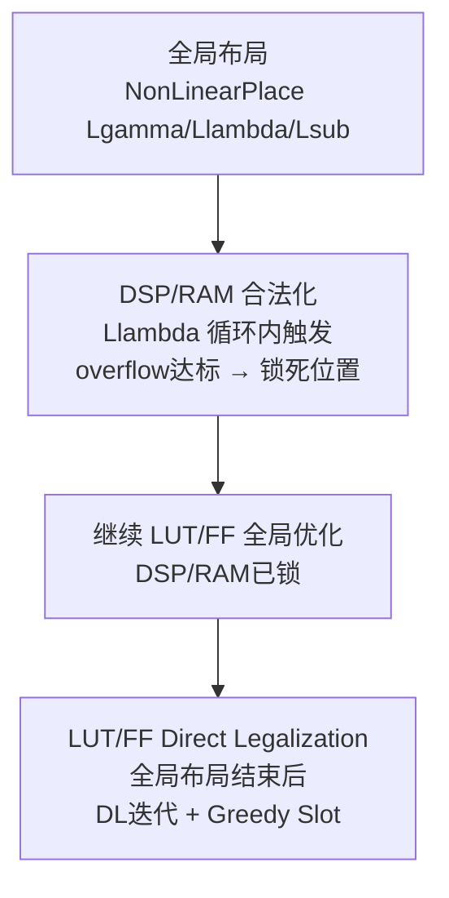
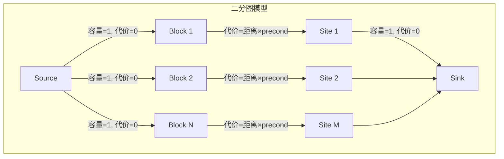
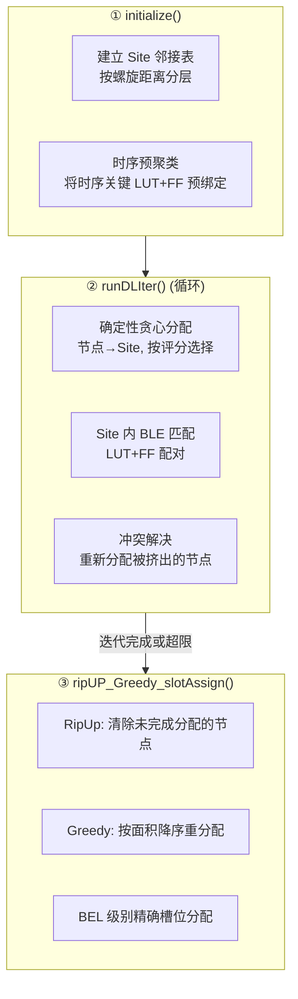
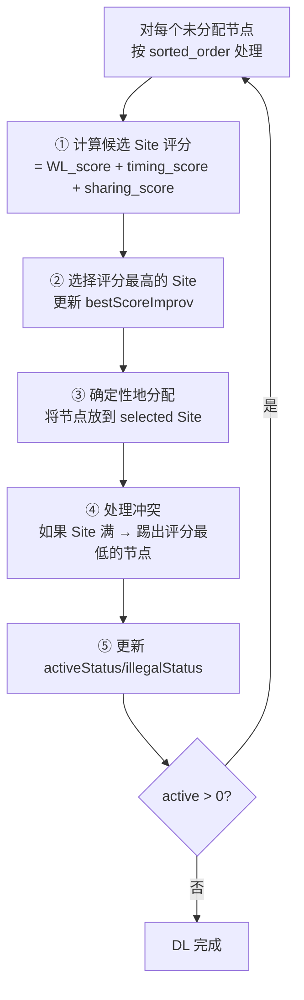
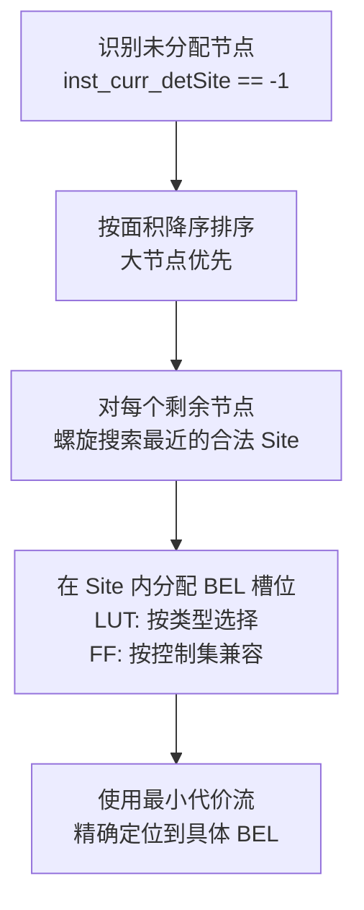
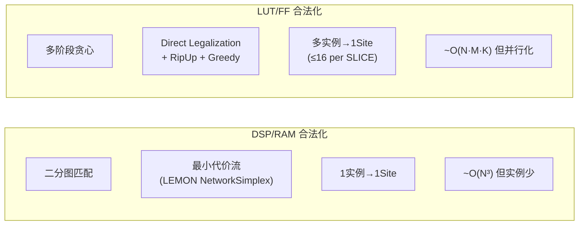

# Day 8: 合法化算法 —— Direct Legalization 与最小代价流

> **学习日期**: 2026-06-21
> **涉及文件**: `ops/lut_ff_legalization/`, `ops/dsp_ram_legalization/`
> **前置知识**: Day4 NonLinearPlace 中的合法化触发, Day2 Site 类型体系

---

## 目录

1. [合法化在布局流程中的位置](#1-合法化在布局流程中的位置)
2. [DSP/RAM 合法化：最小代价流](#2-dspram-合法化最小代价流)
3. [LUT/FF 合法化：Direct Legalization](#3-lutff-合法化direct-legalization)
4. [DL 初始化的数据结构](#4-dl-初始化的数据结构)
5. [DL 迭代流程](#5-dl-迭代流程)
6. [RipUp + Greedy Slot Assignment](#6-ripup--greedy-slot-assignment)
7. [两种合法化模式的对比](#7-两种合法化模式的对比)
8. [核心概念速查](#8-核心概念速查)

---

## 1. 合法化在布局流程中的位置



**为什么分两阶段？**
- DSP/RAM 是大块资源（占多列），早锁死可以稳定 LUT/FF 的剩余空间
- LUT/FF 数量巨大（例：FPGA-example1 有 3000+ 个），需要更复杂的迭代算法

---

## 2. DSP/RAM 合法化：最小代价流

> **文件**: `ops/dsp_ram_legalization/src/legalize.cpp`

### 2.1 算法思想



**数学形式**：将每个 DSP/RAM 实例分配到一个物理 Site，最小化总代价：

$$\min \sum_{i,j} x_{ij} \cdot \text{dist}(i,j) \cdot \text{precond}(i)$$

其中 $x_{ij} \in \{0,1\}$，行和 = 1（一个 block 一个 site），列和 ≤ 1（一个 site 最多一个 block）。

### 2.2 增量距离展开

```cpp
// legalize.cpp:68-86
double distMin = 0.0;
double distMax = lg_max_dist_init;  // = 10.0

while (true) {
    // 只添加 distMin ≤ distance < distMax 的弧
    for (block i, site j):
        dist = |locX[i] - site_x[j]| + |locY[i] - site_y[j]|
        if distMin <= dist < distMax:
            添加弧(i, j), 代价 = dist * precond[i] * flow_cost_scale

    // 运行最小代价流 (Network Simplex)
    mcf.run();

    if flowSize == num_nodes: break;  // 全部匹配成功
    distMin = distMax;
    distMax += lg_max_dist_incr;       // += 10.0
}
```

**为什么增量扩展？**
DSP/RAM 实例数量可能很大，全连接的二分图弧数 = N×M 太大。增量添加弧（按距离范围）大幅减少无用弧。

### 2.3 使用的库

使用 **LEMON** 图库的 `NetworkSimplex` 求解器，这是最小代价流问题的经典算法。

### 2.4 合法化后锁死

```python
# NonLinearPlace.py:496-498
model.lock_mask[2:4] = True         # DSP/RAM 区域锁死
model.update_mask = ~model.lock_mask # 只更新 LUT/FF
pos.grad[...].masked_fill_(dsp_ram_mask, 0.0)  # 梯度清零
```

---

## 3. LUT/FF 合法化：Direct Legalization

> **文件**: `ops/lut_ff_legalization/lut_ff_legalization.py` (497行)

### 3.1 约束条件

LUT/FF 合法化远比 DSP/RAM 复杂，因为**一个 SLICE Site 可以放多个 LUT 和 FF**：

```
1 SLICE = 16 BEL 槽位 (8 LUT + 16 FF 或 16 LUT/FF 混合)
约束条件:
  ① LUT 类型兼容: 同类型 LUT 才能放同一 SLICE
  ② FF 控制集兼容: (CK, SR, CE) 相同才能放同一 SLICE
  ③ BLE 配对: 1 LUT + 2 FF 组成 1 个 BLE
  ④ 容量约束: ≤ 8 LUT + ≤ 16 FF per SLICE
```

### 3.2 算法三个阶段



---

## 4. DL 初始化的数据结构

### 4.1 Site 邻接表 (Spiral Accessor)

```python
# 每个 CLB Site 有一个按距离分层的邻接列表
site_nbrRanges[num_clb_sites, numGroups+1]  # 每层起止索引
site_nbrList[num_clb_sites, maxList]         # 邻接 Site ID 列表

# 分层: [0, d1), [d1, d2), ..., [dn, ∞)
# 搜索时从小到大扩展半径
```

螺旋搜索器 (`spiral_accessor`) 按曼哈顿距离从近到远排列 `(dx, dy)` 偏移量：
```
(0,0), (1,0), (1,1), (0,1), (-1,1), (-1,0), (-1,-1), (0,-1), ...
```

### 4.2 实例状态

```python
inst_curr_detSite[node]     # 当前确定的 Site (-1 = 未分配)
inst_curr_bestSite[node]    # 当前最佳候选 Site
inst_curr_bestScoreImprov[node]  # 最佳评分改进量
```

### 4.3 Site 状态

```python
# 每个 CLB Site 记录已放置的实例信息
site_det_impl_lut[site, 0:15]  # 已放置的 LUT ID (-1 = 空)
site_det_impl_ff[site, 0:15]   # 已放置的 FF ID
site_det_impl_cksr[site, 0:1]  # 已使用的 (CK, SR) 组合
site_det_impl_ce[site, 0:3]    # 已使用的 CE 组合
```

---

## 5. DL 迭代流程

### 5.1 runDLIter 的核心循环



### 5.2 评分函数

```
score = WL_score   × wirelenImprovWt     # 线长改善 (0.1)
      + Timing_score × (lg_alpha/lg_beta) # 时序改善 (时序驱动模式)
      + Sharing_score × lg_alpha          # 网共享改善

WL_score:      新位置 vs 旧位置的 HPWL 变化
Timing_score:  关键路径 slack 改善
Sharing_score: 与同 Site 已有节点共享网的数量
```

### 5.3 DL 循环退出条件

```python
# NonLinearPlace.py:875-886
if activeStatus > 0:   DLStatus = 1    # 继续, 还有活跃节点
elif illegalStatus > 0: DLStatus = -1  # 有冲突但无活跃
else: DLStatus = 0                      # 全部完成

if dlIter > 100 or iter_stable > 5:    # 安全退出
    DLStatus = 0
```

---

## 6. RipUp + Greedy Slot Assignment

### 6.1 为什么需要 RipUp

DL 迭代后可能仍有**部分节点未完成分配**（Site 容量竞争导致死锁）。RipUp 阶段**清除所有未完成节点**，用更激进的方式重分配。

### 6.2 算法



### 6.3 BEL 级别的精确分配

最终步骤 `ripUP_Greedy_slotAssign` 不仅分配 Site，还分配 **BEL 槽位**（`node_z`）：

```python
# 输出 z 坐标，对应 SLICE 内的具体 BEL
# LUT: z ∈ {0..15} → A5LUT, A6LUT, B5LUT, ...
# FF:  z ∈ {0..15} → AFF, AFF2, BFF, ...
updZloc[num_movable_nodes]  # BEL 编号
```

这与 Day2 中的 `map_bel()` 函数对应。

---

## 7. 两种合法化模式的对比



| 维度 | DSP/RAM | LUT/FF |
|------|---------|--------|
| 算法 | 最小代价流 (精确) | Direct Legalization (贪心) |
| 输入规模 | 小 (几十到几百) | 大 (数千到数万) |
| Site:实例 | 1:1 | 1:N (容量16) |
| 约束 | 距离最小化 | 类型+控制集+线长+时序 |
| 触发时机 | Llambda 循环内 | 全局布局结束后 |
| 后续 | 锁死，继续优化 LUT/FF | 结束，写最终结果 |

---

## 8. 核心概念速查

### 8.1 SLICE 内部约束参数

| 常数 | 值 | 含义 |
|------|-----|------|
| `SLICE_CAPACITY` | 16 | 每个 SLICE 最多 16 个 BEL |
| `HALF_SLICE_CAPACITY` | 8 | 半 SLICE 容量 |
| `BLE_CAPACITY` | 2 | 1 LUT + 2 FF = 1 BLE |
| `NUM_BLE_PER_SLICE` | 8 | 每个 SLICE 最多 8 个 BLE |
| `CKSR_IN_CLB` | 2 | 每个 SLICE 最多 2 种 (CK,SR) |
| `CE_IN_CLB` | 4 | 每个 SLICE 最多 4 种 CE |

### 8.2 螺旋搜索的数据流

```
spiral_accessor = [(0,0), (1,0), (1,1), (0,1), (-1,1), (-1,0), ...]
        │
        ▼ site_nbrList[site, :]
[neighbor_site_1, neighbor_site_2, ..., neighbor_site_K]
        │ (按距离排序)
        ▼ site_nbrRanges[site, :]
[start_0, start_1, ..., start_G]  # G个距离区间的起始索引
```

### 8.3 合法化评分公式

```
Score(instance → site) =
    WL_score  × 0.1           ← 线长改善越小越好
  + α × sharing_score         ← 网共享越多越好
  + β × timing_score          ← 时序改善 (负 slack 改善)
```

---

## 📊 全部八天学习总结

| 天数 | 主题 | 层级 | 核心文件 |
|------|------|------|---------|
| Day 1 | 入口与配置 | Python 顶层 | `Placer.py`, `Params.py` |
| Day 2 | 设计与数据 | C++/Python 桥 | `PlaceDB.py`, `place_io/` |
| Day 3 | 算子体系 | PyTorch 封装 | `BasicPlace.py`, `PlaceObj.py` |
| Day 4 | 求解器 | 优化循环 | `NonLinearPlace.py`, `Nesterov` |
| Day 5 | 时序驱动 | STA 分析 | `Timer.py`, `timing_graph.py` |
| Day 6 | 核心算子 | GPU 数学 | `electric_potential/`, `dct/` |
| Day 7 | 拥塞感知 | 面积膨胀 | `rudy/`, `adjust_node_area/` |
| Day 8 | 合法化 | 离散分配 | `lut_ff_legalization/`, `dsp_ram_legalization/` |
